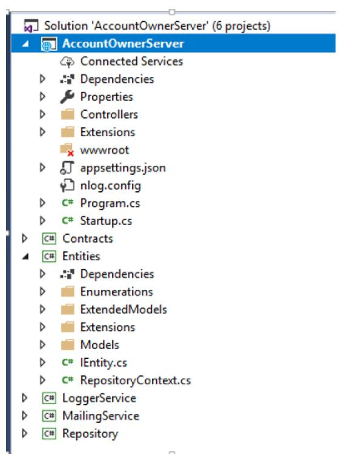

title: ASP.NET Core WebAPI 最佳实践
date: 2022-01-05 10:01:07
categories: 翻译
tags: 

  - dotnet
  - webapi
  - 最佳实践
---

> 该文章翻译自 https://code-maze.com/ 的免费电子书 《ASP.NET CORE WEB API BEST PRACTICES》
## 0x00 INTRODUCTION 简介


当我们在做一个项目的时候，我们的主要目标是使它按照预期的方式工作，并满足客户的所有要求。  

但是，你是否同意创建一个能工作的项目是不够的吗？难道这个项目不应该是可维护和可读的吗？

事实证明，我们需要对我们的项目投入更多的关注，以一种更可读和可维护的方式来编写它们。这句话背后的主要原因是，我们可能不是唯一会在该项目上工作的人。一旦我们完成了这个项目，其他的人很可能也会从事这个项目。 

**那么，我们应该注意什么呢？**  

在本指南中，我们将写下我们认为在开发.NET Core Web API项目时的最佳做法。我们怎样才能使它变得更好，怎样才能使它更容易维护。  

那么，让我们来看看在处理ASP.NET Web API项目时，我们可以应用的一些最佳实践。  

## 0x01 `Startup`启动类和服务配置

在`Startup`类中，有两个方法：`ConfigureServices`方法用于注册服务，`Configure`方法用于将中间件组件添加到应用程序的管道中。

所以，最好的做法是尽量保持`ConfigureServices`方法的简洁和可读性。当然，我们需要在该方法中编写代码来注册服务，但我们可以通过使用扩展方法以更可读和可维护的方式来完成。

例如，让我们看一下注册CORS的错误方法。

```csharp
public void ConfigureServices(IServiceCollection services)
{
    services.AddCors(options =>
    {
        options.AddPolicy("CorsPolicy",
        builder => builder.AllowAnyOrigin()
        .AllowAnyMethod()
        .AllowAnyHeader());
    });
}
```

尽管这种方式可以很好地工作，并且可以毫无问题地注册CORS，但想象一下在注册了几十个服务之后，这个方法的大小。

这根本就不具有可读性。

更好的方式是创建一个包括静态方法的扩展类
```csharp
public static class ServiceExtensions
{
    public static void ConfigureCors(this IServiceCollection services)
    {
        services.AddCors(options =>
        {
            options.AddPolicy("CorsPolicy",
                builder => builder.AllowAnyOrigin()
                .AllowAnyMethod()
                .AllowAnyHeader());
        });
    }
}
```
然后在`IServiceCollection`类型上调用这个扩展方法
```csharp
public void ConfigureServices(IServiceCollection services)
{
    services.ConfigureCors();
}
```
要了解更多关于.NET CORE项目配置的问题，请点击[.NET Core Project Configuration](https://code-maze.com/net-core-web-development-part2/)。


## 0x02 项目结构

我们应该总是尝试将我们的应用程序分成小的项目。这样我们就能得到最好的项目组织和关注点分离（SoC）。与我们的实体、接口、访问数据库、日志消息或发送电子邮件相关的业务逻辑应该总是在一个单独的.NET类库项目中。

我们应用程序中的每个小项目都应该包含许多文件夹来组织业务逻辑。

这里只是一个简单的例子，说明一个完整的项目应该是什么样子的。




## 0x03 基于环境的设置

当我们开发我们的应用程序时，该应用程序是在开发环境中。但是一旦我们发布我们的应用程序，它就会在生产环境中。因此，为每个环境单独配置总是一个好的做法。

在.NET Core中，这很容易实现。

一旦我们创建了项目，我们就会得到`appsettings.json`文件，当我们展开它时，我们就会看到`appsetings.Development.json`文件。


这个文件中的所有设置都将被用于开发环境。

我们应该添加另一个文件`appsettings.Production.json`，以便在生产环境中使用它。


生产文件将被放置在开发文件的正下方。
有了这个设置，我们可以在不同的`appsettings`文件中存储不同的设置，根据我们的应用程序所处的环境，.NET Core将为我们提供正确的设置。关于这个话题的更多信息，请查看《[ASP.NET Core中的多个环境](https://docs.microsoft.com/en-us/aspnet/core/fundamentals/environments?view=aspnetcore-6.0&viewFallbackFrom=aspnetcore-2.1)》。

## 0x04 数据访问层

在许多例子和不同的教程中，我们可能看到DAL在主项目中实现，并在每个控制器中实例化。这是我们不应该做的。

当我们使用DAL时，我们应该将其创建为一个单独的服务。这在.NET Core项目中非常重要，因为当我们把DAL作为一个独立的服务时，我们可以在IOC（控制反转）容器中注册它。IOC是.NET Core的内置功能，通过将DAL注册为IOC中的服务，我们可以通过简单的构造函数注入在任何控制器中使用它。

```csharp
public class RepoService
{
    private IRepository _repository;
    public RepoService(IRepository repository)
    {
    	_repository = repository;
    }
}
```

存储库的逻辑也应该始终基于接口和通用。请看这篇文章。[.Net Core系列--第四部分](https://code-maze.com/net-core-web-development-part4/)，看看我们如何在.NET Core的项目中实现存储库模式。


## 0x05 Controllers 控制器

控制器应该总是尽可能的干净。我们不应该在里面放置任何业务逻辑。

因此，我们的控制器应该负责通过构造函数注入来接受服务实例，并组织HTTP操作方法（GET, POST, PUT, DELETE, PATCH...）。

```csharp
public class OwnerController: Controller
{
    private ILoggerManager _logger;
    private IRepoService _repoService;
    public OwnerController(ILoggerManager logger, IRepoService repoService)
    {
        _logger = logger;
        _repoService = repoService;
    }
    [HttpGet]
    public IActionResult GetAllOwners()
    {
        
    }
    [HttpGet("{id}", Name = "OwnerById")]
    public IActionResult GetOwnerById(Guid id)
    {
        
    }
    [HttpGet("{id}/account")]
    public IActionResult GetOwnerWithDetails(Guid id)
    {
        
    }
    [HttpPost]
    public IActionResult CreateOwner([FromBody]Owner owner)
    {
        
    }
    [HttpPut("{id}")]
    public IActionResult UpdateOwner(Guid id, [FromBody]Owner owner)
    {
        
    }
    [HttpDelete("{id}")]
    public IActionResult DeleteOwner(Guid id)
    {
        
    }
}
```

## 0x06 Actions 

我们的`Action`应该始终是干净和简单的。他们的职责包括处理HTTP请求，验证模型，捕捉错误，并返回响应。

```csharp
[HttpPost]
public IActionResult CreateOwner([FromBody]Owner owner)
{
    try
    {
        if (owner.IsObjectNull())
        {
        	return BadRequest("Owner object is null");
        }
        if (!ModelState.IsValid)
        {
        	return BadRequest("Invalid model object");
        }
        //additional code
        return CreatedAtRoute("OwnerById", new { id = owner.Id }, owner);
    }
    catch (Exception ex)
    {
        _logger.LogError($"Something went wrong inside the CreateOwner action: {ex}");
        return StatusCode(500, "Internal server error");
    }
}
```

在大多数情况下，我们的`Action`应该将IActionResult作为返回类型（有时我们想返回一个特定的类型或JsonResult...）。这样，我们就可以使用.NET Core中所有返回结果和状态代码的方法。

最常用的方法是:

- **OK** => 返回200状态代码
- **NotFound** => 返回404状态代码
- **BadRequest** => 返回400状态代码
- **NoContent** => 返回204状态代码
- **Created, CreatedAtRoute, CreatedAtAction** => 返回201状态代码
- **Unauthorized** => 返回 401 状态代码
- **Forbid** => 返回403状态代码
- **StatusCode** => 返回我们作为输入提供的状态代码

## 0x07 全局错误拦截

在上面的例子中，我们的`Action`有自己的`try-catch`块。这一点非常重要，因为我们需要在我们的`Action`方法中处理所有的错误（在其他方式中，这些错误是无法处理的）。许多开发者在他们的`Action`中使用try-catch块，这种方法绝对没有错。但是，我们希望我们的`Action`是干净和简单的，因此，从我们的`Action`中移除try-catch块，并将它们放在一个集中的地方，是一个更好的方法。

.NET Core为我们提供了一种方式，通过使用内置的并可随时使用的中间件，只需一点点代码就可以实现全局的异常处理。我们所要做的就是通过修改在`Startup`类，在`Configure`方法添加该中间件。

```csharp
public void Configure(IApplicationBuilder app, IHostingEnvironment env)
{
    app.UseExceptionHandler(config =>
    {
        config.Run(async context =>
        {
            context.Response.StatusCode = (int)HttpStatusCode.InternalServerError;
            context.Response.ContentType = "application/json";
            var error = context.Features.Get<IExceptionHandlerFeature>();
            if (error != null)
            {
                var ex = error.Error;
                await context.Response.WriteAsync(new ErrorModel()
                {
                    StatusCode = context.Response.StatusCode,
                    ErrorMessage = ex.Message
                }.ToString());
            }
        });
    });
}
```

我们甚至可以通过创建自定义中间件来编写我们自己的自定义错误处理程序:

```csharp
public class CustomExceptionMiddleware
{
    //constructor and service injection
    public async Task Invoke(HttpContext httpContext)
    {
        try
        {
        	await _next(httpContext);
        }
        catch (Exception ex)
        {
            _logger.LogError("Unhandled exception ...", ex);
            await HandleExceptionAsync(httpContext, ex);
        }
    }
}
```

然后我们需要把它添加到Application 管道中

```csharp
public static IApplicationBuilder UseCustomExceptionMiddleware(this IApplicationBuilder builder)
{
	return builder.UseMiddleware<CustomExceptionMiddleware>();
}
app.UseCustomExceptionMiddleware();
```


## 0x08 使用`ACTIONFILTERS`移除重复代码

ASP.NET Core中的过滤器允许我们在请求管道的特定阶段之前或之后运行一些代码。因此，我们可以用它们来执行我们需要在`Action`方法中重复的验证动作。

当我们在动作方法中处理一个PUT或POST请求时，我们需要验证我们的模型对象，正如我们在本文的动作部分所做的那样。因此，这将导致我们的验证代码的重复，而我们想避免这一点（基本上我们想尽可能地避免任何代码的重复）。

我们可以通过使用ActionFilters来做到这一点。而不是在我们的行动中使用验证代码：

```csharp
if (!ModelState.IsValid)
{
	// bad request and logging logic
}
```

我们可以创建我们自己的过滤器

```csharp
public class ModelValidationAttribute : ActionFilterAttribute
{
    public override void OnActionExecuting(ActionExecutingContext context)
    {
        if (!context.ModelState.IsValid)
        {
            context.Result = new BadRequestObjectResult(context.ModelState);
        }
    }
}
```

并在Startup类的ConfigureServices方法中注册它

```csharp
services.AddScoped<ModelValidationAttribute>();
```

现在，我们可以在我们的`Action`方法中使用该过滤器。你可以在我们的[ActionFilters文章](https://code-maze.com/action-filters-aspnetcore/)中阅读更多关于它的内容。


## 0x09 使用DTOs来返回接口和接收参数

尽管我们可以使用同一个模型类（与数据库表的映射实体类）来返回结果或接受来自客户端的参数，但这并不是一个好的做法。一个更好的做法是将与数据库通信的实体与与客户端通信的实体分开。是的，答案是使用DTOs。

模型类是我们数据库表的完整表示，就像这样，我们用它来从数据库中获取数据。但是一旦数据被获取，我们应该将[数据映射到DTO](https://code-maze.com/automapper-net-core/)，并将结果返回给客户端。通过这样做，如果由于某种原因我们必须改变数据库，我们将不得不只改变模型类而不改变DTO，因为客户端可能仍然希望得到相同的结果。你可以在[.NET Core系列的第五部分](https://code-maze.com/net-core-web-development-part5/)阅读更多关于DTO的用法。

我们不应该只是在GET请求中使用DTOs。我们也应该把它们用于其他动作。例如，如果我们有一个POST或PUT动作，我们也应该使用DTOs。要阅读更多关于这个主题的内容，你可以阅读[.NET Core系列的第六部分](https://code-maze.com/net-core-web-development-part6/)。

此外，DTOs还可以防止我们项目中的循环引用问题。

## 0x10 路由

在.NET Core Web API项目中，我们应该使用Attribute Routing而不是Conventional Routing。这是因为Attribute Routing帮助我们将路由参数名称与动作方法中的实际参数相匹配。另一个原因是路由参数的描述。当我们看到名称为 "ownerId "的参数比仅仅是 "id "更容易阅读。

我们可以在控制器顶部和动作本身的顶部使用`[Route]`属性。

```csharp
[Route("api/[controller]")]
public class OwnerController: Controller
{
    [Route("{id}")]
    [HttpGet]
    public IActionResult GetOwnerById(Guid id)
    {
    }
}
```

还有一种方法可以为Controller和Action创建路由。

```csharp
[Route("api/owner")]
public class OwnerController: Controller
{
    [HttpGet("{id}")]
    public IActionResult GetOwnerById(Guid id)
    {
    }
}
```

关于哪种方式更好，有不同的意见，但我们总是推荐第二种方式，这也是我们在项目中一直使用的。

当我们谈论路由时，我们需要提到路由的命名规则。我们可以为我们的`Action`使用描述性的名字，但是对于路由/终端，我们应该使用名词而不是动词。

错误的例子：

```csharp
[Route("api/owner")]
public class OwnerController : Controller
{
    [HttpGet("getAllOwners")]
    public IActionResult GetAllOwners()
    {
    }
    [HttpGet("getOwnerById/{id}"]
    public IActionResult GetOwnerById(Guid id)
    {
    }
}
```

正确的例子：

```csharp
[Route("api/owner")]
public class OwnerController : Controller
{
    [HttpGet]
    public IActionResult GetAllOwners()
    {
    }
    [HttpGet("{id}"]
    public IActionResult GetOwnerById(Guid id)
    {
    }
}
```

关于Restful实践的更详细的解释，请查看：[顶级REST API最佳实践](https://code-maze.com/top-rest-api-best-practices/)。

## 0x11 日志

如果我们计划将我们的应用程序发布到生产中，我们应该有一个日志机制。在弄清我们的软件在生产中的表现时，日志信息是非常有帮助的。

.NET Core通过使用ILogger接口有自己的日志实现。通过使用依赖注入方式来实现它是非常容易的。

```csharp
public class TestController: Controller
{
    private readonly ILogger _logger;
    public TestController(ILogger<TestController> logger)
    {
    	_logger = logger;
    }
}
```

然后在我们的Action中，我们可以通过使用_logger对象来来记录各种日志级别的日志信息。

.NET Core支持与各种日志提供者兼容的日志API。因此，我们可以使用不同的日志提供者来实现我们项目内的日志逻辑。

NLog是一个很好的库，可以用来实现我们的自定义日志逻辑。它是可扩展的，支持结构化的日志，而且非常容易配置。我们可以在控制台窗口、文件、甚至数据库中记录我们的信息。

要了解更多关于在.NET Core内使用这个库的信息，请查看：[.NET Core系列--用Nlog做日志](https://code-maze.com/net-core-web-development-part3/)。

Serilog也是一个不错的选择。它与.NET Core内置的日志系统相兼容。

## 0x12 分页、搜索、排序

在查询我们的API时，我们不希望返回所有资源的集合。这可能会导致性能问题，而且对于公共或私人API来说，它根本没有优化。它可能会严重地影响查询速度，甚至在严重的情况下导致应用程序崩溃。

所以，实现分页、搜索和排序会让我们的用户轻松找到并浏览返回的结果，同时也会缩小结果的范围，这肯定会加快进程。

涉及到这三个功能的实现有很多，所以要想了解更多，你可以阅读我们关于[分页](https://code-maze.com/paging-aspnet-core-webapi/)、[搜索](https://code-maze.com/searching-aspnet-core-webapi/)和[排序](https://code-maze.com/blazor-webassembly-sorting/)的文章。


## 0x13 APIs的版本控制

对我们的API的要求可能会随着时间的推移而改变，我们想改变我们的API以支持这些要求。但是，在这样做的同时，我们不想让API的消费者改变他们的代码，因为对于一些客户来说，旧的版本工作得很好，而对于其他客户来说，新的版本才是首选。为了支持这一点，最好的做法是实现API版本化。这将保留旧的功能，并仍然促进新的功能。

我们可以通过几种不同的方式实现版本控制。

- 用特性:`[ApiVersion("2.0")]`
- 我们可以在请求中提供一个版本作为查询字符串：https://some-address/api-version-2.0
- 通过使用URL的版本控制:`[Route("api/{v:apiversion}/some-resource")]` 和请求: https://some-address/2.0/resource
- 使用Http头的版本控制
- 使用conventions

我们在《Ultimate ASP.NET Core Web API》一书中非常详细地讨论了这个功能和其他所有的最佳实践。


## 0x14 使用异步代码

通过异步编程，我们避免了性能瓶颈，增强了我们应用程序的响应能力。

其原因是，我们向服务器发送请求，在等待响应时不会阻塞它。所以，通过向服务器发送一个请求，线程池会委托一个线程来处理这个请求。一旦该线程完成了它的工作，它就会返回线程池，为下一个请求释放自己。在某些时候，应用程序从数据库中获取数据，它需要将这些数据发送给请求者。这时，线程池提供另一个线程来处理这项工作。一旦工作完成，一个线程就要回到线程池中。

需要理解的一件事是，如果我们向一个服务端发送一个请求，而应用程序需要三秒或更多的时间来处理这个请求，那么我们使用异步代码可能无法更快执行这个请求。它将花费与同步请求相同的时间。但主要的优势是，使用异步代码，线程不会被阻塞三秒或更多的时间，因此它将能够处理其他的请求。这就是我们的解决方案的可扩展性。

当然，将异步代码用于数据库的获取操作只是一个例子。还有很多其他使用异步代码的案例，可以提高我们应用程序的可扩展性，防止线程池阻塞。

举例来说，在我们的控制器中使用同步操作的Action:

```csharp
[HttpGet]
public IActionResult Get()
{
    var owners = _repository.Owner.GetAllOwners();
    _logger.LogInfo($"Returned all owners from database.");
    return Ok(owners);
}
```

可以使用下面的异步代码代替

```csharp
[HttpGet]
public async Task<IActionResult> Get()
{
    var owners = await _repository.Owner.GetAllOwnersAsync();
    _logger.LogInfo($"Returned all owners from database.");
    return Ok(owners);
}
```

当然，这个例子只是一部分。对于完整的异步例子，你可以阅读我们在[ASP.NET Core中实现异步代码](https://code-maze.com/async-generic-repository-pattern/)的文章。

## 0x15 缓存

缓存使我们能够提高应用程序的性能。

- 我们可以使用不同的缓存技术。

- 响应缓存
- 内存中的缓存
- 分布式缓存
- ...

缓存是很有用的，因为从内存中读取数据要比从磁盘中读取数据快得多。它也可以减少数据库的成本。基本上，其主要目的是减少对存储层的访问需求，从而改善数据检索过程。

不同的缓存技术使用不同的技术来缓存数据。响应缓存减少了对网络服务器的请求数量。它减少了网络服务器为生成响应而执行的工作量。另外，它使用头文件来指定我们要如何缓存响应。内存缓存使用服务器内存来存储缓存的数据。分布式缓存技术使用分布式缓存将数据存储在内存中，用于托管在云或服务器场的应用程序。该缓存在处理请求的服务器之间共享。

基本上，由开发者决定哪种缓存技术最适合他们正在开发的应用程序。

你可以在我们的《终极ASP.NET Core Web API》一书中读到更多关于缓存的内容，以及本文中的所有主题。


## 0x16 使用ReadFormAsync方法

有很多情况下，我们需要从表单中读取内容。其中一种情况是当我们用Web API项目上传文件时。在这种情况下，我们可以使用`Request.Form`来从Body中获取我们的文件。

```csharp
public IActionResult Upload()
{
    try
    {
        var file = Request.Form.Files[0];
        var folderName = Path.Combine("Resources", "Images");
        var pathToSave = ...
        ...
        return Ok(new { dbPath });
    }
    ...
}
```

这里我们使用`Requst.Form.Files`来访问请求体中的文件。如果我们不为数百万用户创建一个大型应用，这是一个很好的解决方案。但是如果我们为很多用户创建了一个大型的应用程序，使用这个解决方案，我们最终会出现线程池饥饿的情况。这主要是因为`Request.Form`是采用同步技术从表单主体中读取数据。

如果我们想避免这种情况（线程池饿死），我们必须使用ReadFromAsync方法的异步方式。

```csharp
public asynct Task<IActionResult> Upload()
{
    try
    {
        var formCollection = await Request.ReadFormAsync();
        var file = formCollection.Files.First();
        //everything else is the same
}
```

要看这两种方法的完整例子，你可以阅读我们的用[.NET Core Web API上传文件](https://code-maze.com/upload-files-dot-net-core-angular/)文章。


## 0x17 CryptoHelper和数据保护

我们不会谈论我们如何不应该把密码作为纯文本存储在数据库中，以及由于安全原因我们需要对它们进行散列（hash）。这已经超出了本指南的范围。互联网上有各种散列算法，也有许多不同的、伟大的方法来散列（hash）密码。

如果我们想自己做，我们总是可以使用IDataProtector接口，这在现有的项目中是很容易使用和实现的。

要注册它，我们所要做的就是在ConfigureServices方法中使用AddDataProtection方法。然后它就可以通过依赖注入的方式被注入。

```csharp
private readonly IDataProtector _protector;
public EmployeesController( IDataProtectionProvider provider)
{
    _protector = provider.
    CreateProtector("EmployeesApp.EmployeesController");
}
```

最后，我们可以使用它。`_protector.Protect("要保护的字符串")`。

你可以在[用IDataProtector保护数据](https://code-maze.com/data-protection-aspnet-core/)一文中了解更多信息。

但如果需要一个为.NET核心的应用程序提供支持且易于使用的库，`CryptoHelper`是一个相当不错的库。

CryptoHelper是一个独立的密码散列器，用于.NET Core，使用PBKDF2实现。密码散列器使用新的数据保护栈。


## 0x18 内容协商

默认情况下，.NET Core Web API返回一个JSON格式的结果。在大多数情况下，这就是我们所需要的。

但是，如果我们的Web API的消费者想要另一种响应格式，例如XML，怎么办？

为此，我们需要创建一个服务器配置，以期望的方式格式化我们的响应。

```csharp
public void ConfigureServices(IServiceCollection services)
{
    services.AddMvc(config =>
    {
        // Add XML Content Negotiation
        config.RespectBrowserAcceptHeader = true;
        config.InputFormatters.Add(new XmlSerializerInputFormatter());
        config.OutputFormatters.Add(new XmlSerializerOutputFormatter());
    });
}
```

有时，客户可能会请求一种我们的Web API不支持的格式，那么最好的做法是用状态代码406不可接受来回应。这也可以在我们的ConfigureServices方法中进行配置。

```csharp
config.ReturnHttpNotAcceptable = true;
```

我们还可以创建我们自己的自定义格式规则。

内容协商是一个相当大的话题，所以如果你想了解更多关于它的信息，请查看[.NETCore中的内容协商](https://code-maze.com/content-negotiation-dotnet-core/)。


## 0x19 安全和使用JWT 

在Web开发中，JSON Web Token（JWT）正变得越来越流行。由于.NET Core的内置支持，实现JWT认证非常容易。JWT是一个开放的标准，它允许我们以安全的方式在客户端和服务器之间以JSON对象的方式传输数据。

我们可以在ConfigureServices方法中配置JWT认证：

```csharp
public void ConfigureServices(IServiceCollection services)
{
    services.AddAuthentication(JwtBearerDefaults.AuthenticationScheme)
    .AddJwtBearer(options =>
    {
        options.TokenValidationParameters = new TokenValidationParameters
        {
        //Configuration in here
        };
    });
}
```

为了在应用程序中使用它，我们需要在`Configure`方法中调用这段代码。

```csharp
app.UseAuthentication();
```

我们也可以将JWT用于授权部分，只需在JWT配置中加入角色要求。要想更详细地了解.NET Core中的JWT认证和授权，请查看[JWT与.NET Core和Angular系列的第一部分](https://code-maze.com/authentication-aspnetcore-jwt-1/)和[第二部分](https://code-maze.com/authentication-aspnetcore-jwt-2/)。


### ASP.NET Core Identity

此外，如果你想在你的应用程序中使用一些高级安全操作，如密码重置、电子邮件验证、第三方授权等，你可以随时参考[ASP.NET Core Identity](https://code-maze.com/asp-net-core-identity-series/)。

ASP.NET Core Identity是Web应用程序的会员系统，包括会员、登录和用户数据。它包含了很多功能来帮助我们进行用户管理的过程。在我们的[ASP.NET Core Identity系列](https://code-maze.com/asp-net-core-identity-series/)中，你可以学到很多关于这些功能以及如何在你的ASP.NET Core项目中实现它们。

### 使用 IdentityServer4 – OAuth2 and OpenID Connect

`IdentityServer4`是一个授权服务器，可以被多个客户端用于认证操作。它与用户存储管理无关，但它可以很容易地与`ASP.NET Core Identity`库集成，为所有客户端应用程序提供强大的安全功能。`OAuth2`和`OpenID Connect`是允许我们建立更安全的应用程序的协议。OAuth2与授权部分更相关，而OpenID Connect（OIDC）则与身份（认证）部分相关。我们可以使用不同的流程和端点来应用安全，并从授权服务器获取令牌。你可以随时阅读[RFC 6749在线文档](https://tools.ietf.org/html/rfc6749)来了解更多关于OAuth2的信息


## 0x20 测试我们的应用

我们应该尽可能多的为我们的应用程序写测试。我们知道，从我们的经验来看，没有时间总是这样做，但它对于检查我们正在编写的软件的质量非常重要。我们可以在开发阶段发现潜在的错误，并确保我们的应用程序在发布到生产中之前能够按照预期工作。当然，还有许多其他的原因要为我们的应用程序写测试。
要了解更多关于ASP.NET Core应用程序（Web API、MVC或任何其他）的测试，你可以阅读我们的[ASP.NET Core测试系列](https://code-maze.com/asp-net-core-testing/)，在那里我们会详细解释这个过程。


## 0x21 总结

在本指南中，我们的主要目标是让您熟悉在.NET Core中开发Web API项目时的最佳实践。其中一些也可用于其他框架，因此，牢记这些总是有帮助的。

感谢你阅读本指南，我希望你在其中找到有用的东西。

如果你想学习如何在真实世界的项目中应用这些实践，请查看我们的[Ultimate ASP.NET Core 3 Web API](https://code-maze.com/ultimate-aspnet-core-3-web-api)项目，它包含了这个免费电子书中所描述的概念、具体例子和实现，以及更多的东西!

编码愉快!

