title: 如何让你的React应用更快
date: 2022-07-01 10:01:07
categories: 翻译
tags: 

  - react
  - hooks
  - 最佳实践
---

> 该文章翻译自 https://medium.com/bitsrc/how-to-make-your-react-application-even-faster-3efe9387cbb1

React的核心是优化，好吧，多少有点。React有很多方法来确保的应用程序有很好的UI渲染性能，同时不需要你承担繁重的工作。但大中型的应用程序却一次又一次的遇到性能问题。你有遇到过这种情况嘛？

幸运的是，又集中不同的方法可以优化你的Web应用程序，例如:

1.  API 优化
2.  Code Bundling （代码绑定）
3.  依赖优化
4. 节流和防抖
5. React Fragment  和样式约定 （styling convention）
6. Memoization （在本文中，我们将严格关注如何借助示例来实现这一点，以便初学者更容易理解）

首先**Memoization**  到底是什么?

根据维基百科介绍，Memoization 的定义如下

> In computing, **memoization** or **memoisation** is an optimisation technique used primarily to speed up computer programs by storing the results of expensive function calls and returning the cached result when the same inputs occur again

够简单吧？让我们从React的角度来理解这一点。

在React中，每个组件本质上都是一个函数，这些函数通常需要一些属性(**props**)并返回一些*漂亮*的HTML(暂时忘记**state**)，假设**props**在多次渲染中没有变化，那么HTML会改变吗？

答案是不！我们可以只使用最后渲染的HTML并让我们的处理器休息一下。

这个过程就叫做**memoization**:缓存函数结果并作为后续请求返回值的过程。

这个概念也可以用于通用函数。假设有一个`addMillionNumbers` 函数，如何百万的数字没有变化，就不要添加它，而是缓存它！

现在，下一个问题是: 我们如何使用React来实现这一点?


###  1. 使用React.memo

如上所述，如果props没有更改，我们可以防止组件不必要的重新渲染。让我们借助三个不同的例子来一起看看。

让我们构建一个简单的应用程序，我们假装通过单击按钮调用某个API。API返回给定人的姓名和最喜欢吃的菜！

**案例1. 子组件不依赖任何prop**

对于案例1，我们将不使用人员状态，而是对Intro.js中的值进行硬编码，这样我们可以避免将任何props传入子组件中

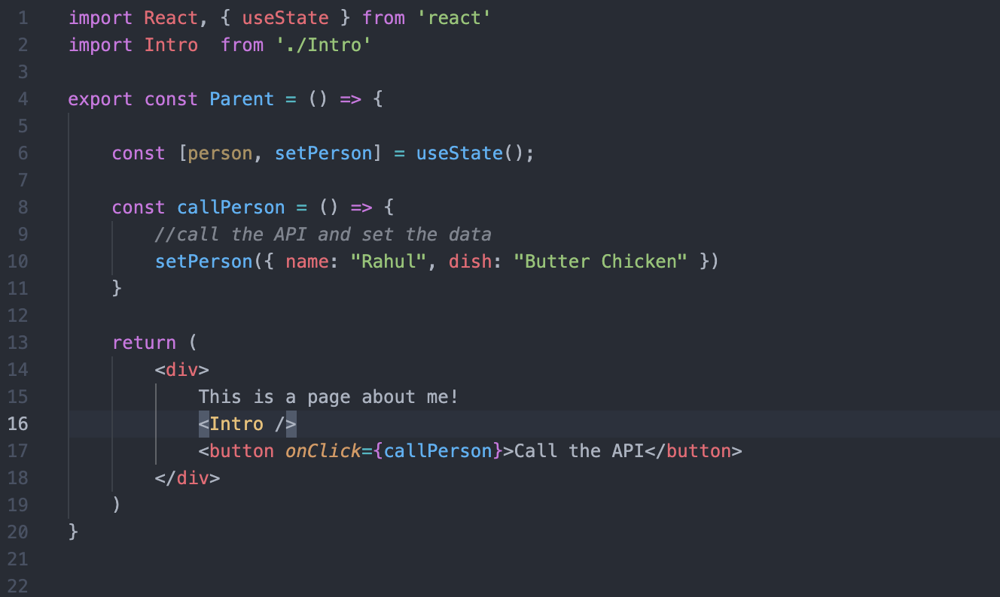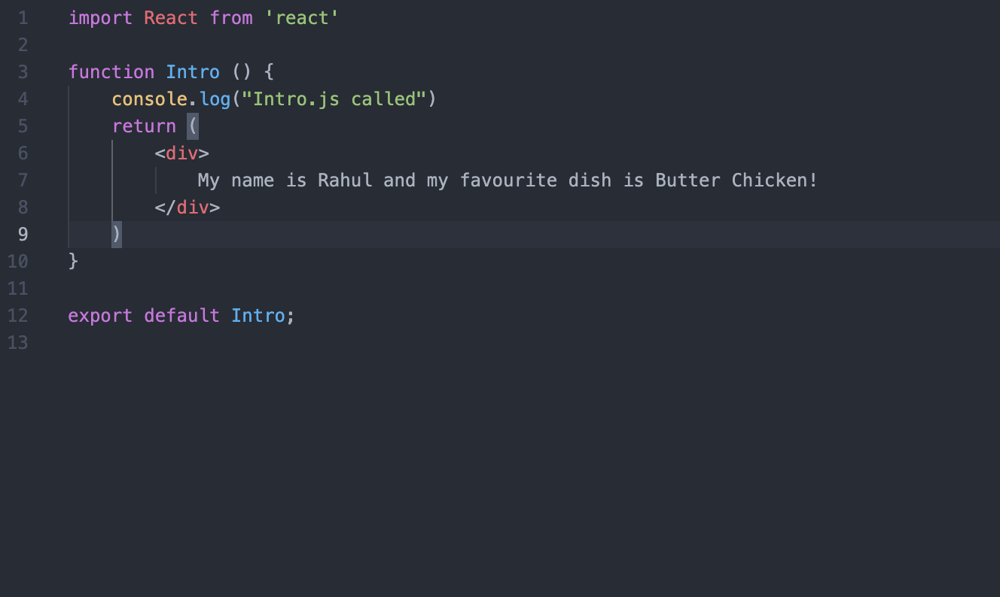

*Parent Control 和 Introl Control*

从上面的代码中，我们知道任何点击次数都不会影响Intro组件的返回内容。然而，情况似乎并非如此。单击该按钮10次将重新渲染Intro组件10次，如下图所示。这种行为看起来没有必要，特别是如果我们正在处理一个可能导致用户体验和性能问题的大型应用程序。


解决方案呢？**React.memo!** 让我们稍微改变一下Intro.js!

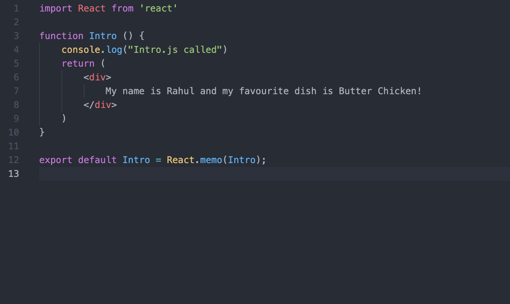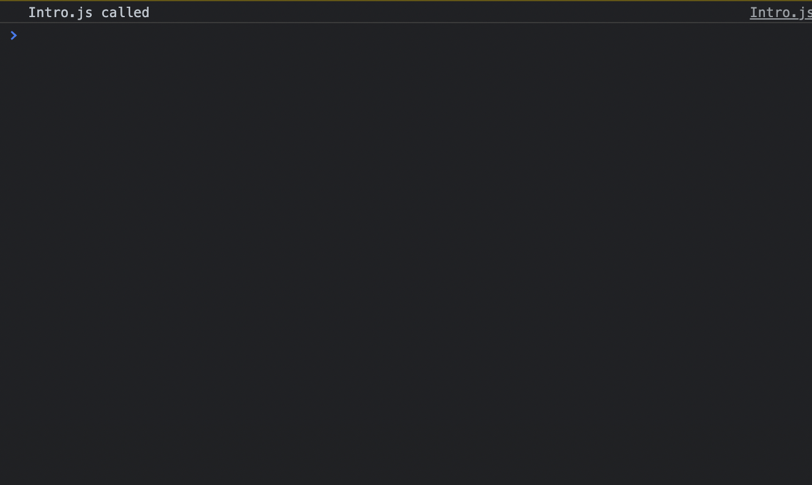

现在我们导出的不是一个普通的Intro组件，而是名为`React.memo(Intro)`的高阶组件，并将其分配给同一个变量。memo的作用是防止组件重新渲染，除非依赖项(props) 已更改。正如我们所看到的，在这种情况下，我们没有任何props传入，因此组件根本不会重新渲染！所以”Intro.js called“ 打打印了一次

**案例2 子组件依赖props**

对于案例2 我们将使用人员状态，并只将名称作为props传递给子组件

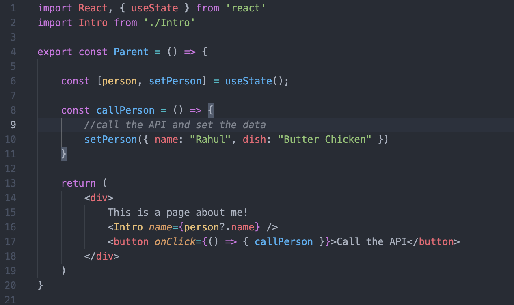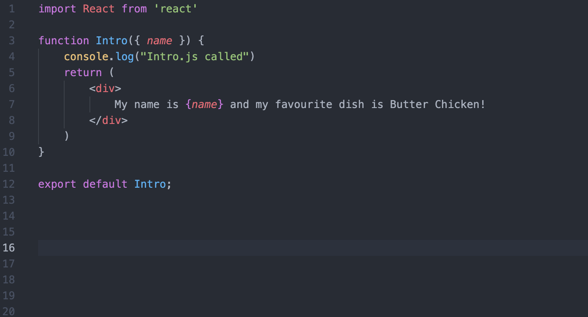

同样，从上面的代码中，我们知道任何点击次数都不会影响Intro组件的返回值。然而在单击按钮10次后，Intro组件再次重绘了10次！这仅仅是因为每次点击都会出发Parant中的状态更改，无论值如何，都会重新渲染自身及其子组件。

解决方案？不用猜了！React.memo!

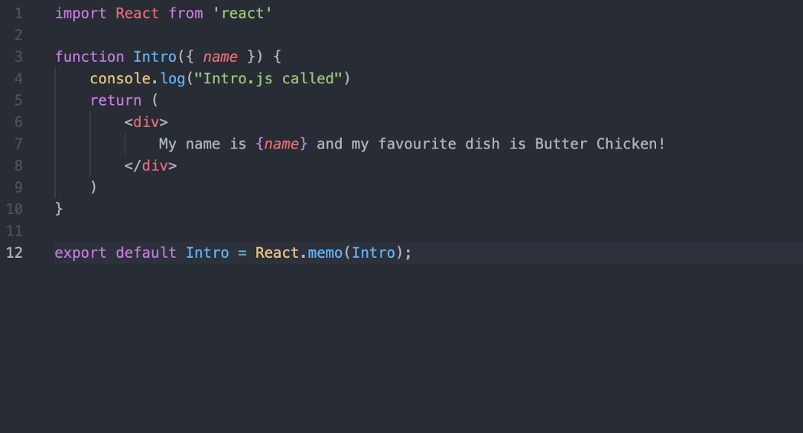


这次React.memo所做的是将组件的新props与之前的props进行比较。如果值相同，它不会重新渲染它，但是如果props发生变化，比如说在这种情况下名称从Rahul更改为Aman，它会重新渲染Intro组件。不会给你带来任何破坏，结果”Intro.js called“ 在控制台中只打印了一次。

案例3. 子组件依赖对象props

让我们在这里也应用相同的解决方案

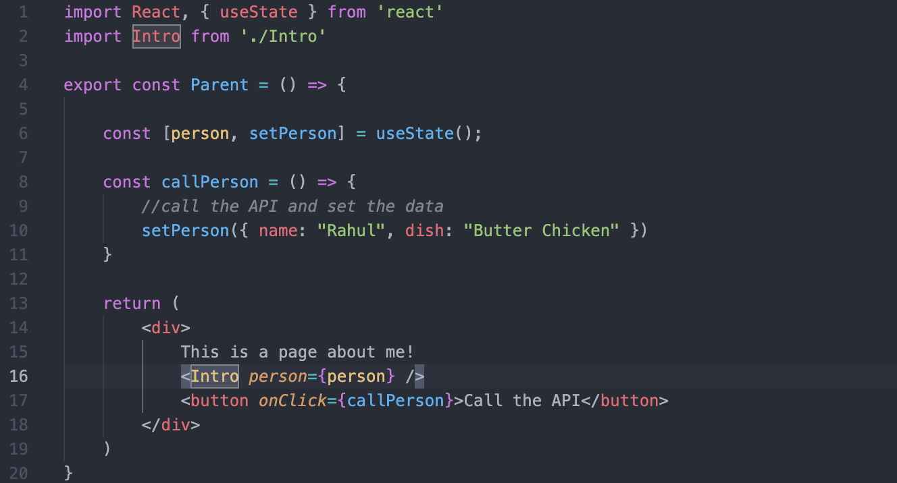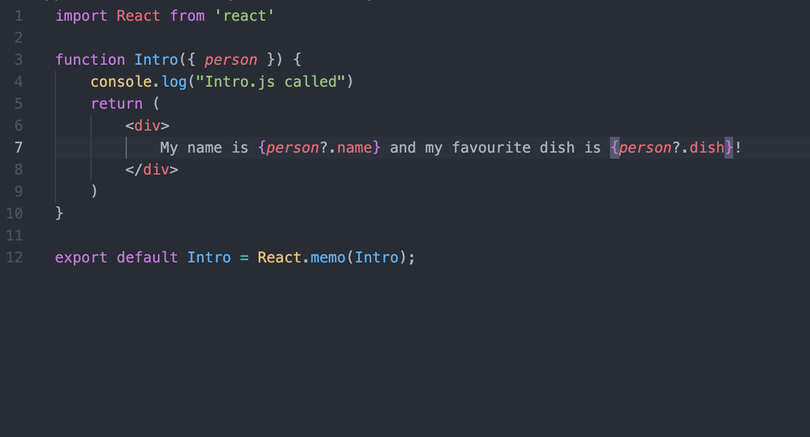

如果运行上面的代码，你会注意到我们这次失败了! Intro组件在单击按钮时会重新渲染多次！React.memo失败了！但是等等，为什么会这样？

这是由于Javascript中称为相等比较([**Equality Comparison**](https://developer.mozilla.org/en-US/docs/Web/JavaScript/Equality_comparisons_and_sameness) )的东西而发生的。 简而言之,person(object)引用发生了变化，尽管里面的值保持不变。这称为浅比较(**Shallow Compare**)。

> *浅比较：比较对象时，不比较它们的属性——只比较它们的引用。*

默认情况下React.memo对props和props的对象进行浅层比较。因此，随着参考值的变化，对于React.memo的先前值和当前值不同，这会导致重新渲染。但是，我们也有解决方案。要执行深比较而不是浅比较，我们可以使用称之为`areEqual `的东西。

如果 prevProps 和 nextProps 相等，areEqual(prevProps, nextProps) 函数必须返回 true,如下所示

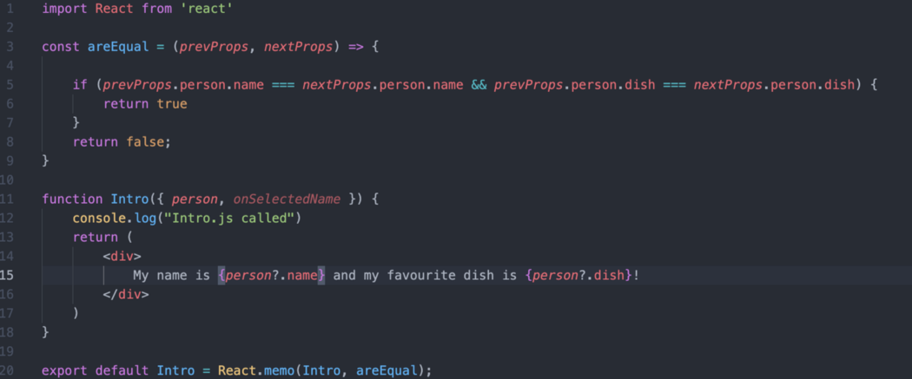

这将告诉React比较对象内部的值并不是对象本身的引用，这正是我们想要的. 结果? “Intro.js called”在控制台中只打印一次。

> 顺便说一句，如果 React.memo 在其实现中有一个 `useState`、`useReducer` 或 `useContext` Hook，它仍然会在状态或上下文更改时重新渲染。

### 2.  使用useCallback

让我们检查另外一个简单示例。在下面的代码中，我们有一个`BigComponent`,它负责在我们的应用程序上呈现支付网关。顾名思义，这个组件时一个庞大的组件，这就是为什么我们 不希望它一次又一次的渲染。

```javascript
export const App = () => {   
  const paymentHandler = () => {console.log("paymentHandler")};   
  return <BigComponent paymentHandler={paymentHandler} /> 
};
```

这是性能问题开始的地方。

1. 每当应用程序内部的任何状态发生变化时，它都会强制重新渲染组件。
2. 这反过来又重新创建了 `paymentHandler`
3. 这又重新创建改变了函数的引用。
4. 当我们将此函数作为属性传递时，BigComponent 将重新渲染。有趣的是，即使 BigComponent 使用上面的 React.memo 进行了记忆，它仍然会重新渲染，因为之前的引用和当前的引用不一样。即使功能本身没有改变！

解决方案？**useCallback**

```javascript
export const App = () => {   
  const paymentHandler = useCallback(() => 
                                     {console.log("paymentHandler")
  }, [dependencyList]);   
  return <BigComponent paymentHandler={paymentHandler} /> 
};
```

useCallback 是一个 React 钩子，它提供了回调函数的记忆版本。仅当依赖项之一发生更改时，此回调的记忆版本才会更改。 dependencyList 的工作方式与它在 useEffect 中的工作方式相似。

扩展上面的例子，如你所见，React.memo无法阻止BigComponet的重新渲染。

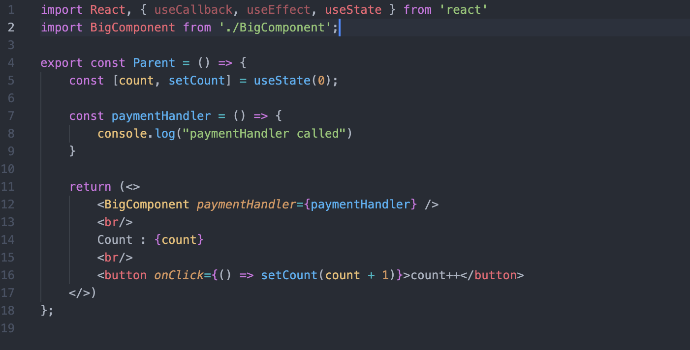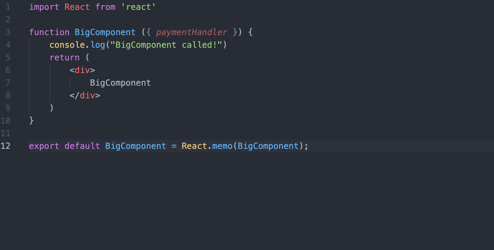

导致点击10次按钮，Big Component会被重新渲染10次。

解决方案：

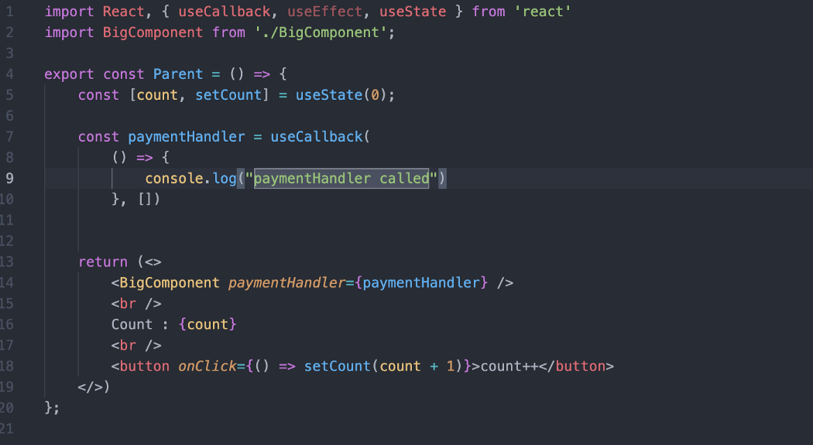

### 3. 使用useMemo

让我们想象一下，我们有一个名为 paymentCalculator 的函数。这是一个计算量大的函数，它将 previousBalance、amountAdded 和 conversionRate 作为输入，并执行一些繁重的计算以提供最终输出。因此，除非这 3 个参数发生变化，否则我们不希望大量运行此函数。这可以通过使用 useMemo 来实现。

```javascript
const amount = useMemo(() => paymentCalculator(dependency), [dependency]);
```

useMemo 将您的函数和一组依赖项作为输入，并记住函数返回的值。 useMemo 只会在依赖项之一发生更改时重新计算记忆值。此外，如果没有提供数组，则每次渲染都会计算一个新的数量。这与缓存值并使用它非常相似，直到依赖列表中的某些内容告诉您重新评估。

### 结论

您可以使用上面给出的示例直接尝试它们并亲自查看效果。在后续文章中，我将讨论更多关于在哪里使用它们以及在哪里不使用它们的信息，以便您可以为您的方法获得最大价值。因此，请订阅并关注我以继续关注！
