c


title: ASP.NET Core中的IdentityServer4--终极新手指南
date: 2022-01-14 10:01:07
categories: 翻译
tags: 

  - dotnet
  - webapi
  - 最佳实践
---

> 该文章翻译自 https://codewithmukesh.com/blog/identityserver4-in-aspnet-core/ 


在这篇文章中，我们将开始学习ASP.NET Core中的IdentityServer4，以及整合它来构建安全解决方案的方法。我们将从头开始创建一个工作解决方案，带你了解这个强大的OpenID框架的各种概念和实现。这是ASP.NET核心中的IdentityServer4系列的第一部分。你可以在这里找到完整的实现源代码。

## 什么是IdentityServer4？

IdentityServer4是一个免费的、开源的OpenID Connect和OAuth 2.0框架，用于ASP.NET Core。换句话说，它是一个用于您的解决方案的认证供应商。它是一个建立在ASP.NET Core的OpenID Connect和OAuth 2.0之上的框架。其主要思想是集中认证提供者。比方说，你有5个APIS/微服务。你真的不需要在每一个应用程序中定义认证逻辑。相反，通过IdentityServer4，你可以集中访问控制，这样每一个API都由中央身份服务器来保障。

另一个很酷的特点是，当客户端（Web应用程序）想要访问一个安全的API时，IdentityServer4会无缝地生成访问令牌来实现这一目标。我们将在文章中进一步讨论这个问题。

## Identity Server概念

这个想法非常简单和直接。用户使用客户端（比方说ASP.NET Core MVC）来访问数据。用户将通过身份服务器的认证来使用客户端。一旦用户被认证使用客户端，客户端就会向API资源发送请求。记住，客户端和API资源都是由一个实体，即IdentityServer来保护的。客户端要求获得一个访问令牌，用它来访问API响应。这样，我们就把认证机制集中到一个服务器上。相当有趣，是吗？

下面是IdentityServer文档中描述的一个流程。

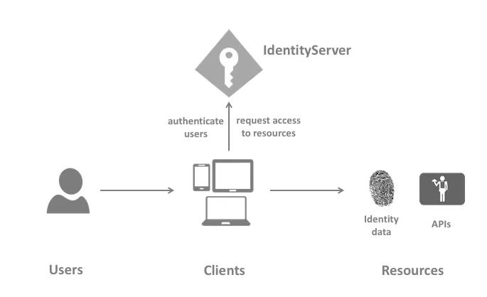


## Identity Server4的职责
Identity Server是一个为您的项目提供的一体化安全解决方案。以下是它的主要特点和职责。

- 保护您的资源
- 使用本地账户存储或通过外部身份提供者对用户进行认证
- 提供会话管理和单点登录 
- 管理和验证客户
- 向客户发放身份和访问令牌
- 验证令牌

## IdentityServer4 项目模板

有几种方法可以启动IdentityServer4项目。最常用的一种是模板。这更像是一个快速启动方案，你使用CLI安装IdentityServer4模板，并选择一个模板，自动为你创建一个已实施的项目。

> PS - 在我们的文章中，我们不会使用这种方法，因为它隐藏了大部分的复杂性，而且你最终不知道幕后到底发生了什么。我们将从头开始实现服务器。一旦你熟悉了它的工作，你就可以使用这些模板了。

在一个工作目录上打开你的Powershell/命令提示符，并运行下面的命令，为你全局安装IdentityServer4模板。


```shell
dotnet new -i identityserver4.templates
```

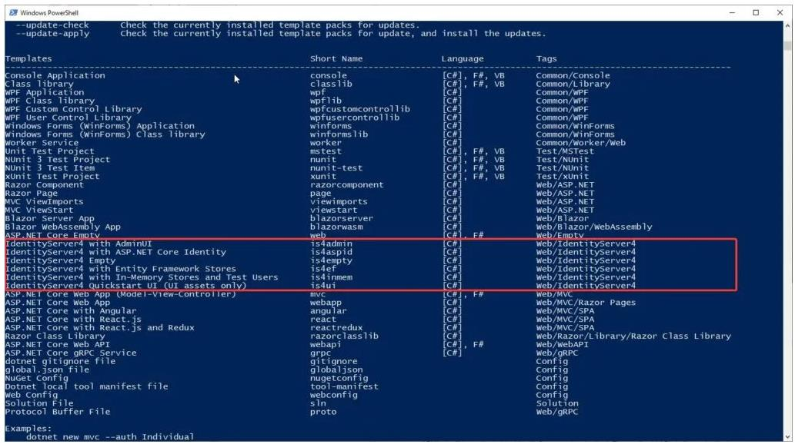


你可以看到已安装的IdentityServer4模板。现在，为了创建一个基于模板的新项目，运行以下程序。


```shell
dotnet new is4inmem
```

这在ASP.NET Core中使用内存用户和配置创建了一个IdentityServer4的实现。但是对于我们的学习目的来说，有很多代码是我们不需要/不了解的。因此，让我们从头开始创建，以便我们理解IdentityServer4实现的每一个部分。


## 我们将建造什么？

1. 创建一个具有内存用户和商店的IdentityServer4主机项目（用于测试）。
2. 建立一个ASP.NET Core API (这是需要被IdentityServer4保护的资源)
3. 建立一个调用API的Web客户端

让我们先在Visual Studio 2019 中创建一个空白解决方案。

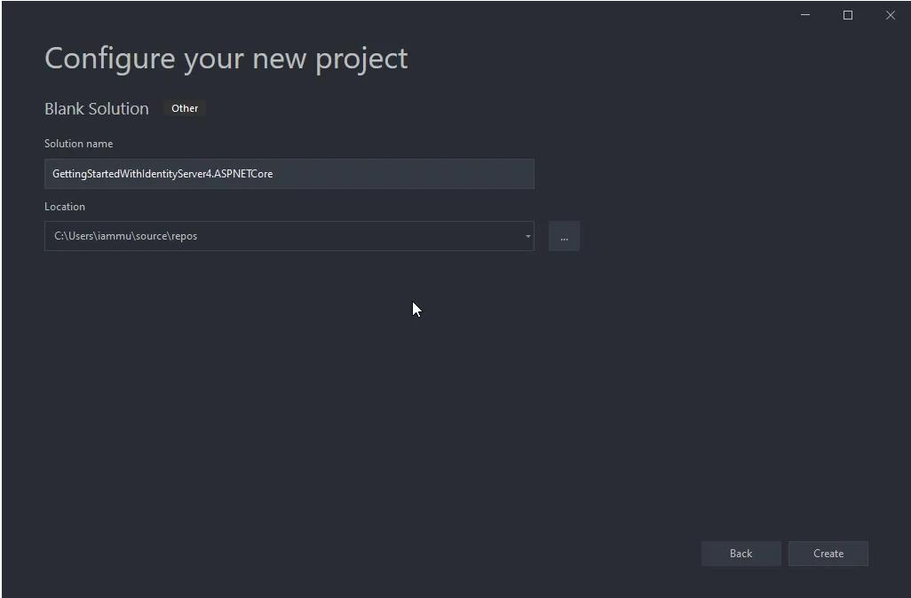

现在，在空白的解决方案中加入一个新的ASP.NET Core空项目。确保你已经选择了空模板。这个项目将承载实际的IdentityServer。

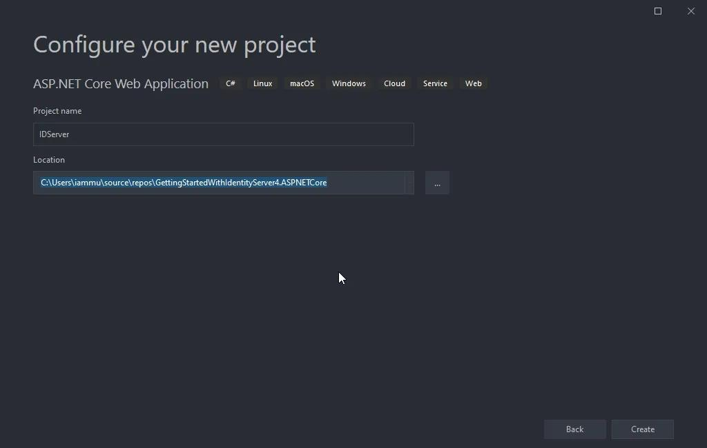

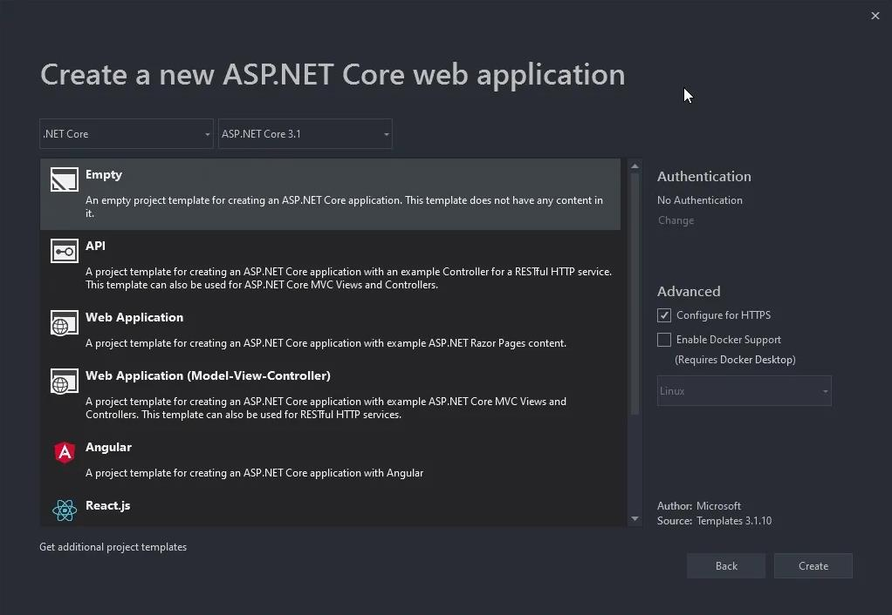

## 为ASP.NET Core项目安装IdentityServer4软件包

在新创建的项目中，让我们来安装IdentityServer4软件包。在软件包管理器控制台中运行以下命令。

```powershell
Install-Package IdentityServer4
```

### 添加 In-Memory Configuration

我们将在我们的代码中添加所有的配置，以达到演示目的。请注意，当你在生产中集成IdentityServer4时，情况就不是这样了。这是一个更容易理解每一个组件的方法。在IdentityServer项目的根目录下，添加一个新的类，并将其命名为**IdentityConfiguration.cs**

```csharp
public class IdentityConfiguration
{
}
```

### 测试用户

让我们在我们的配置文件中添加一个测试用户。出于演示的目的，我们将在代码中定义用户数据。在另一篇文章中，我们将学习如何整合Entity Framework和ASP.NET Core Identity来通过数据库管理用户。但是现在让我们把事情简单化，理解上下文。

在IdentityConfiguration类中加入以下内容。这段代码返回一个带有一些特定JWT请求的TestUser。

```csharp
public static List<TestUser> TestUsers =>
    new List<TestUser>
    {
        new TestUser
        {
            SubjectId = "1144",
            Username = "mukesh",
            Password = "mukesh",
            Claims =
            {
                new Claim(JwtClaimTypes.Name, "Mukesh Murugan"),
                new Claim(JwtClaimTypes.GivenName, "Mukesh"),
                new Claim(JwtClaimTypes.FamilyName, "Murugan"),
                new Claim(JwtClaimTypes.WebSite, "http://codewithmukesh.com"),
            }
        }
};
```

### Identity Resources

Identity Resources是指像userId、电子邮件、电话号码这样的数据，是某个特定身份/用户独有的东西。在下面的代码中，我们将添加OpenId和Profile 资源。将此代码复制到你的**IdentityConfiguration**类中。

```csharp
public static IEnumerable<IdentityResource> IdentityResources =>
    new IdentityResource[]
    {
        new IdentityResources.OpenId(),
        new IdentityResources.Profile(),
    };
```

### API Scopes

如前所述，我们的主要意图是保护一个API（我们还没有建立。） 所以，这个API可以有作用域。作用域是指授权用户可以做什么。例如，我们现在可以有两个作用域--读、写。让我们把我们的API命名为myAPI。复制下面的代码到**IdentityConfiguration.cs**中

```
public static IEnumerable<ApiScope> ApiScopes =>
    new ApiScope[]
    {
        new ApiScope("myApi.read"),
        new ApiScope("myApi.write"),
    };
```

### API Resources

现在，让我们来定义API本身。我们将给它一个名字myApi，并提到支持的范围，以及秘密。确保对这个秘密代码进行哈希处理。这个散列的代码将被保存在IdentityServer内部。

```csharp
public static IEnumerable<ApiResource> ApiResources =>
    new ApiResource[]
    {
        new ApiResource("myApi")
        {
            Scopes = new List<string>{ "myApi.read","myApi.write" },
            ApiSecrets = new List<Secret>{ new Secret("supersecret".Sha256()) }
        }
    };
```

### Client

最后，我们必须定义谁将被授权访问我们的受保护资源，在我们的例子中是myApi。给出一个合适的客户名称和ID。这里我们将GrantType设置为ClientCredentials。

```csharp
public static IEnumerable<Client> Clients =>
    new Client[]
    {
        new Client
        {
            ClientId = "cwm.client",
            ClientName = "Client Credentials Client",
            AllowedGrantTypes = GrantTypes.ClientCredentials,
            ClientSecrets = { new Secret("secret".Sha256()) },
            AllowedScopes = { "myApi.read" }
        },
    };
```

### ASP.NET Core 中注册IdentityServer4 

让我们在ASP.NET Core DI容器中注册IdentityServer4。打开Startup.cs，在ConfigureServices方法中添加以下内容。这里将使用我们在IdentityConfiguration类中定义的所有静态资源、客户端和用户。

```csharp
services.AddIdentityServer()
    .AddInMemoryClients(IdentityConfiguration.Clients)
    .AddInMemoryIdentityResources(IdentityConfiguration.IdentityResources)
    .AddInMemoryApiResources(IdentityConfiguration.ApiResources)
    .AddInMemoryApiScopes(IdentityConfiguration.ApiScopes)
    .AddTestUsers(IdentityConfiguration.TestUsers)
    .AddDeveloperSigningCredential();
```

### In-Memory configuration stores

如前所述，我们将对身份服务器的配置进行硬编码，以使事情简单易懂。有几个内存存储需要配置。这些配置在HOST项目中是硬编码的，只在应用程序启动时加载一次。这主要用于开发和原型设计阶段。如果配置很少随时间变化，这种方法也可能适用于生产环境。


### Signing Credentials

基本上，IdentityServer需要证书来验证它的使用。但是，同样，为了开发的目的，由于我们没有带任何证书，我们使用AddDeveloperSigningCredential()扩展。你可以在这里阅读更多关于它的信息。

最后，在Configure方法中，添加以下一行来添加IdentityServer中间件。

```csharp
app.UseRouting();
app.UseIdentityServer();
app.UseEndpoints(endpoints =>
{
    endpoints.MapGet("/", async context =>
    {
        await context.Response.WriteAsync("Hello World!");
    });
});
```


### 运行 IdentityServer4

配置完IdentityServer4后，让我们编译并运行它。

> 确保注意你的IdentityServer运行的端口。对我来说，它是44322。你可以通过修改你的ASP.NET Core项目的属性文件夹下的 launchsettings.json来设置你的自定义端口。

### OpenID Discovery Document

**OpenID Connect Discovery Document**在`/.known/openid-configuration`中可供所有OpenID提供商使用。该文件包含您的身份服务器的定义，如令牌端点（您POST到的端点，以检索访问令牌）、支持的范围、运行中的身份服务器的URL，等等。

要了解更多关于这个标准化的信息，请阅读这里。

```
https://localhost:44322/.well-known/openid-configuration
```

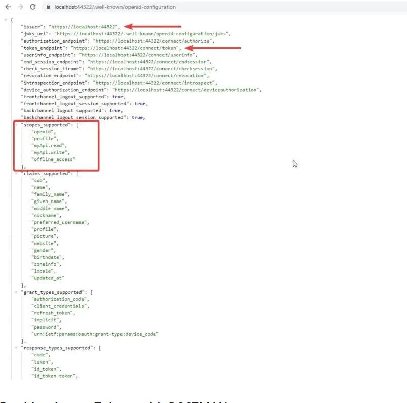


## 用POSTMAN获取访问令牌

从**Discovery Document**中，你可以知道配置的端点来检索访问令牌。打开POSTMAN，向访问令牌端点发送一个POST请求。确保你的请求正文中有以下参数。

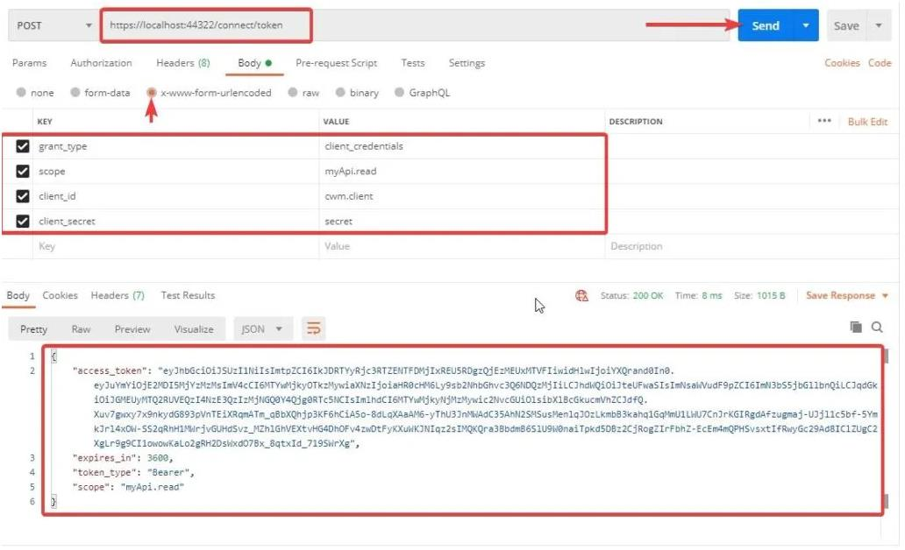


一旦成功授权，IdentityServer4会返回给您一个访问令牌，该令牌的有效期为3600秒或1小时。

请注意，我们已经传入了一些参数，如grant_type、使用范围、客户ID和秘密。


### 理解Token

现在我们有了一个有效的访问令牌。让我们到`jwt.io`去解码访问令牌。还有一点，任何JWT令牌都可以被解码，因此要确保不要在令牌上添加任何敏感数据，如密码等。

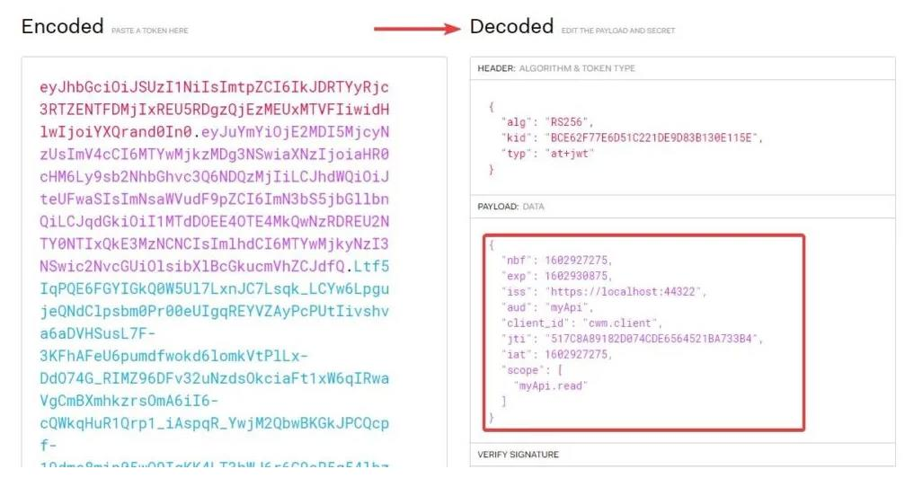

你可以看到，我们设置的所有数据都可以在我们的访问令牌中找到。正如我们前面提到的概念是，我们将使用这个令牌来访问受身份服务器保护的API。


## 用IdentityServer4保证ASP.NET Core WebAPI的安全

在本节中，我们将学习如何用IdentityServer4保护ASP.NET Core WebAPI，并使用访问令牌访问受保护的端点。

在解决方案中添加一个新的ASP.NET Core WebAPI项目。请注意，理想情况下，我们必须将身份服务器放在一个单独的解决方案中。但是为了演示的目的，我们将把它全部放入一个解决方案中。

另外，请确保在你运行解决方案时，第一个运行的项目是IdentityServer4。要启用多启动项目，右击解决方案并点击属性。

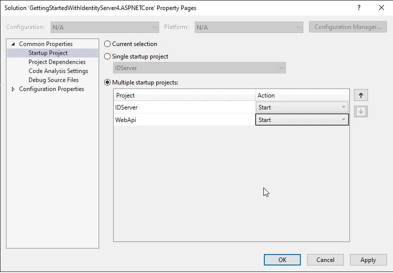


让我们运行该解决方案。在WebAPI的浏览器上，访问/weatherforecast。这是ASP.NET Core中的默认控制器。我们将使用这个端点，并用IdentityServer4来保护它。

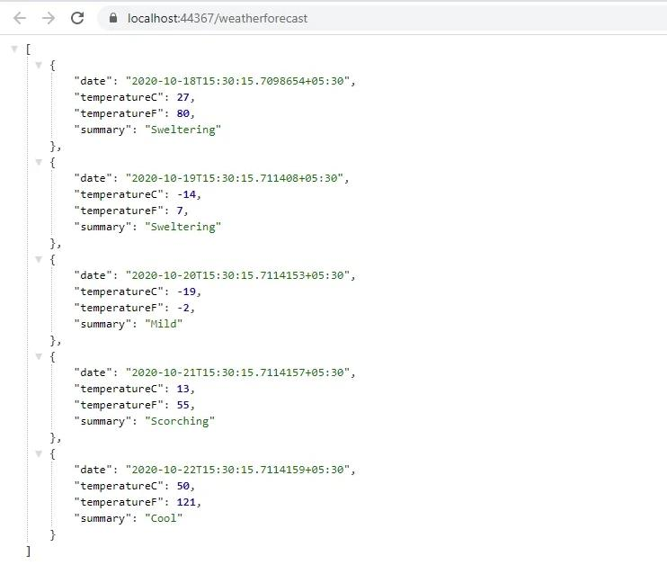


现在，回到WebAPI项目，通过包管理器控制台安装以下包。

```powershell
Install-Package IdentityServer4.AccessTokenValidation
```

让我们开始将认证中间件添加到管道中。打开WebAPI项目的Startup.cs，在ConfigureService方法中添加以下内容。

```csharp
services.AddAuthentication("Bearer")
    .AddIdentityServerAuthentication("Bearer", options =>
    {
        options.ApiName = "myApi";
        options.Authority = "https://localhost:44322";
    });
```


第4行决定了WebAPI资源的名称。记得我们已经在服务器项目配置中定义了这个名称吗？
第5行提出了IdentityServer已经启动并运行的URL。重要的是，首先运行IdentityServer，然后是WebAPI项目，如果有客户的话，接着是客户。(我们将在本文的后面添加一个客户端的Web项目)

最后在`Configure`方法中，添加以下内容。确保定义中间件的顺序是一样的。


```csharp
app.UseAuthentication();
app.UseAuthorization();
```

现在进入默认的WeatherController，给控制器添加一个Authorize Attribute。这样，我们就确保了我们的WebAPI端点。

```csharp
[ApiController]
[Route("[controller]")]
[Authorize]
public class WeatherForecastController : ControllerBase
```

### 获取Token

打开POSTMAN，向weatherforecast端点发送一个GET请求。理想情况下，你应该得到一个401未经授权的错误。

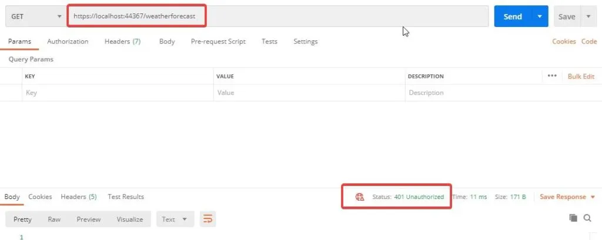


向带有有效参数的`IdentityServer`令牌端点发送一个GET请求。这将得到一个访问令牌。还记得我们之前做的这些吗？现在，我们将使用这个令牌来访问安全的API控制器。

### 使用访问令牌访问API
再次向`weatherforecast`端点发送一个GET请求，但这次要有一个额外的授权标头。在POSTMAN中切换到授权标签，从下拉菜单中选择`Bearer Token`，并粘贴你从`IdentityServer4`收到的访问令牌。现在点击发送。**200 OK**

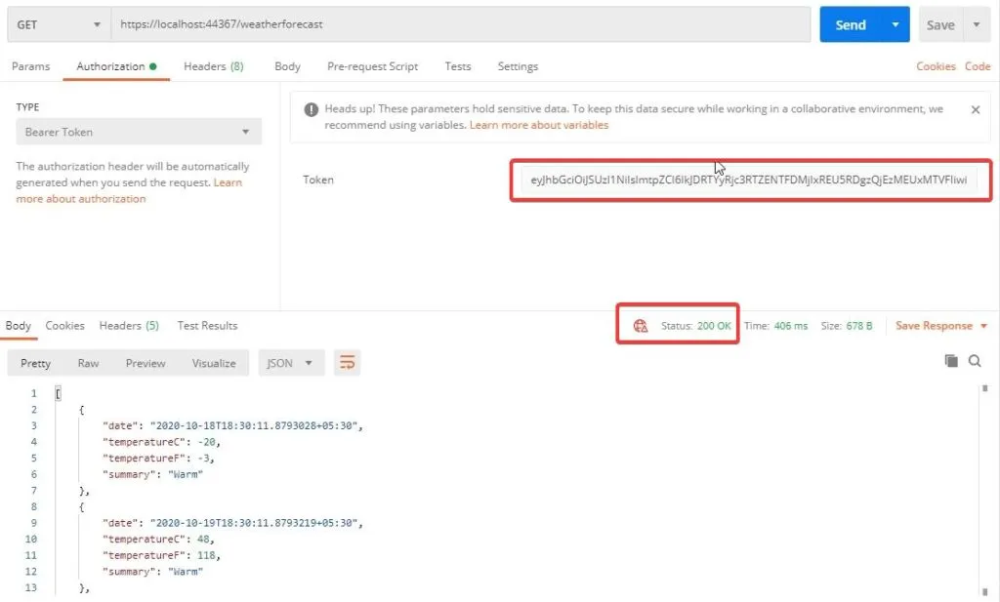


因此，我们的API使用IdentityServer4来保证安全。现在，我们将停止使用POSTMAN作为我们的客户端。而是让我们引入一个Web项目作为客户端，它将尝试访问我们安全的API控制器。这将是IdentityServer4的最常见的使用情况。让我们看看如何实现这一点。


## 建立一个访问安全的API的Web客户端

首先，在我们的解决方案中创建一个新项目，并命名为WebClient。我们将使用一个不使用认证的MVC项目。

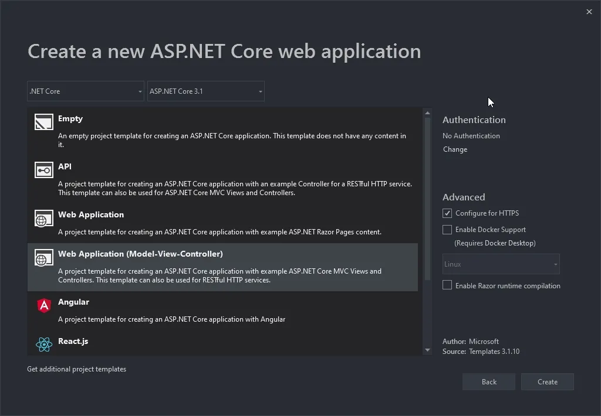

首先，安装以下软件包。

```powershell
Install-Package IdentityModel
```

接下来，我们需要一个能够访问IdentityServer4的服务，并请求一个访问令牌，MVC项目可以用它访问API数据。明白了吗？

在WebClient项目中，添加一个新的文件夹，并将其命名为Services。在这里，我们添加TokenService接口和实现。注意，输入参数将是一个scope的字符串。


```csharp
public interface ITokenService
{
    Task<TokenResponse> GetToken(string scope);
}
```

```csharp
public class TokenService : ITokenService
{
    private DiscoveryDocumentResponse _discDocument {get;set;}
    public TokenService()
    {
        using(var client = new HttpClient())
        {
            _discDocument = client.GetDiscoveryDocumentAsync("https://localhost:44322/.well-known/openid-configuration").Result;
        }
    }
    public async Task<TokenResponse> GetToken(string scope)
    {
        using (var client = new HttpClient())
        {
            var tokenResponse = await client.RequestClientCredentialsTokenAsync(new ClientCredentialsTokenRequest
            {
                Address = _discDocument.TokenEndpoint,
                ClientId = "cwm.client",
                Scope = scope,
                ClientSecret = "secret"
            });
            if(tokenResponse.IsError)
            {
                throw new Exception("Token Error");
            }
            return tokenResponse;
        }
    }
}
```

第3行，这里是我们之前安装的软件包中的DiscoveryDocumentReponse类。
第4行到第10行，在构造函数中，我们使用HTTPClient从IdentityServer OpenID配置端点获取文档数据。注意，我们在这里对URL进行了硬编码。理想情况下，我们必须在appsettings.json中定义它们，并在运行时使用IOptions模式来获取它们。

还记得我们在我们的IdentityServer4配置中添加了一些客户端吗？我们将在这里使用这些数据。第17到20行，我们定义了Address、ClientId、Scope和ClientSecret。

现在，我们期待着来自我们的API的天气数据。因此，让我们创建一个新的模型类来容纳这些数据。在WebClient项目中，在Models文件夹下添加一个新类，并命名为WeatherModel。添加以下代码。

```csharp
public class WeatherModel
{
    public DateTime Date { get; set; }
    public int TemperatureC { get; set; }
    public int TemperatureF => 32 + (int)(TemperatureC / 0.5556);
    public string Summary { get; set; }
}
```

接下来，在`HomeController`中添加一个新的方法，我们可以通过安全接口获取令牌后，并从数据接口中获取数据。大体来说，这个方法将做以下事情

1. 使用令牌服务，与IdentityServer4对话，获取一个有效的访问令牌。
2. 将访问令牌设置为HttpClient的JWT头。
3. 使用Http客户端并与安全的API对话以获得天气数据。由于我们加入了JWT令牌，我们在验证WebClient使用WebAPI时应该没有任何问题，对吗？

代码如下：

```csharp
public async Task<IActionResult> Weather()
{
    var data = new List<WeatherModel>();
    var token = await _tokenService.GetToken("myApi.read");
    using (var client = new HttpClient())
    {
        client.SetBearerToken(token.AccessToken);
        var result = await client.GetAsync("https://localhost:44367/weatherforecast");
        if(result.IsSuccessStatusCode)
        {
            var model = await result.Content.ReadAsStringAsync();
            data = JsonConvert.DeserializeObject<List<WeatherModel>>(model);
            return View(data);
        }
        else
        {
            throw new Exception("Failed to get Data from API");
        }
    }           
}
```

接下来，为天气方法添加一个新的视图。这将是一个简单的视图，其中将有一个显示WeatherModel数据列表的表。这些数据将由控制器传递给视图。

```csharp
@model List<WeatherModel>
@{
    ViewData["Title"] = "Weather";
}
<h1>Weather</h1>
<table class="table table-striped">
    @foreach (var weather in Model)
    {
        <tr>
            <td>@weather.Date</td>
            <td>@weather.Summary</td>
            <td>@weather.TemperatureC</td>
            <td>@weather.TemperatureF</td>
        </tr>
    }
</table>
```

最后，在WebClient项目的Startup.cs中，在ConfigureServices方法中添加以下内容，以便在ASP.NET Core DI容器中注册TokenService。

```csharp
services.AddSingleton<ITokenService, TokenService>();
```

这就是实现授权访问接口需要做的所有事。现在，按以下顺序编译并运行所有3个项目-->身份服务器，WebAPI，最后是WebClient。在WebClient的浏览器中，导航到./home/weather。如果一切顺利，你将看到来自我们安全的WebAPI的实际数据。

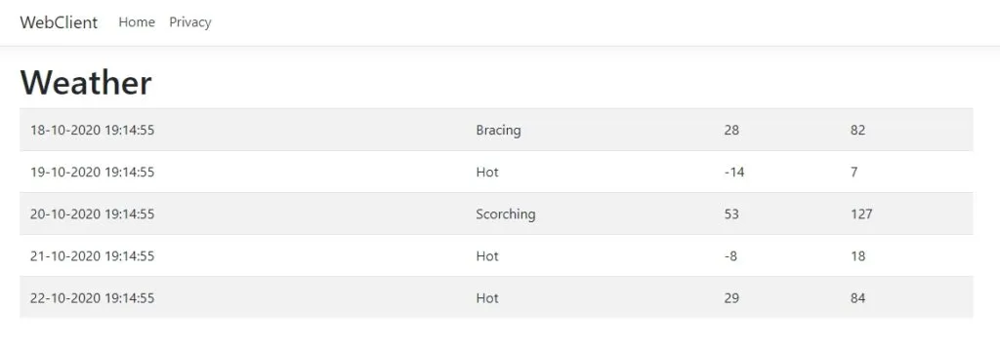


好的，那么你如何验证你的客户是否真的被授权？很简单，在Postman上打开一个新的标签，并向WebAPI端点发送一个GET请求。现在，如果你的客户真的被授权了，这意味着POSTMAN应该向你喊出401错误。因此，很明显，IdentityServer正在保护我们的API端点，并授权我们的WebClient应用程序来使用WebAPI。相当棒，是吗？

我们现在就来总结一下这篇文章。在本系列的下一篇文章中，我们将介绍更多的高级主题和IdentitySevrer4的实现。我们将通过一些概念，如在服务器项目中添加IdentityServer4用户界面，用IdentityServer4保护客户端项目，删除内存存储，用实际的数据库代替，添加ASP.NET核心身份以更有效地管理用户，等等。一旦有了下一篇文章，我将在此更新其链接。敬请关注。


## 总结

在这篇详细的文章中，我们开始使用ASP.NET Core中的IdentityServer4，涵盖了基本的概念和术语，如资源、测试用户、客户端。此外，我们还建立了一个具有3个项目（认证服务器、WebAPI、WebClient）的工作解决方案，其中WebAPI受到IdentityServer的保护，并向有效的WebClient发放令牌。你可以在这里找到整个实现的[源代码](https://github.com/iammukeshm/GettingStartedWithIdentityServer4.ASPNETCore)。

