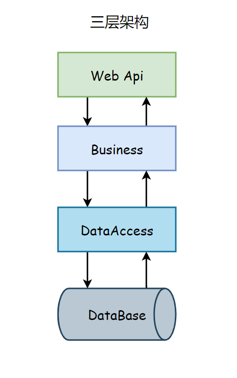
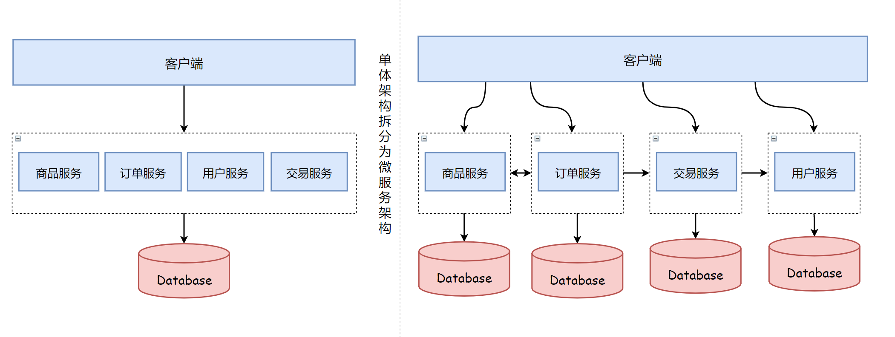
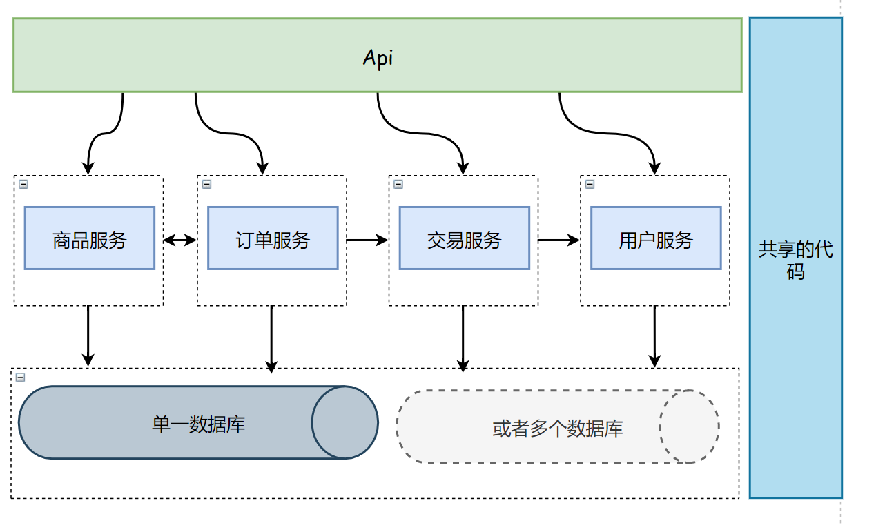
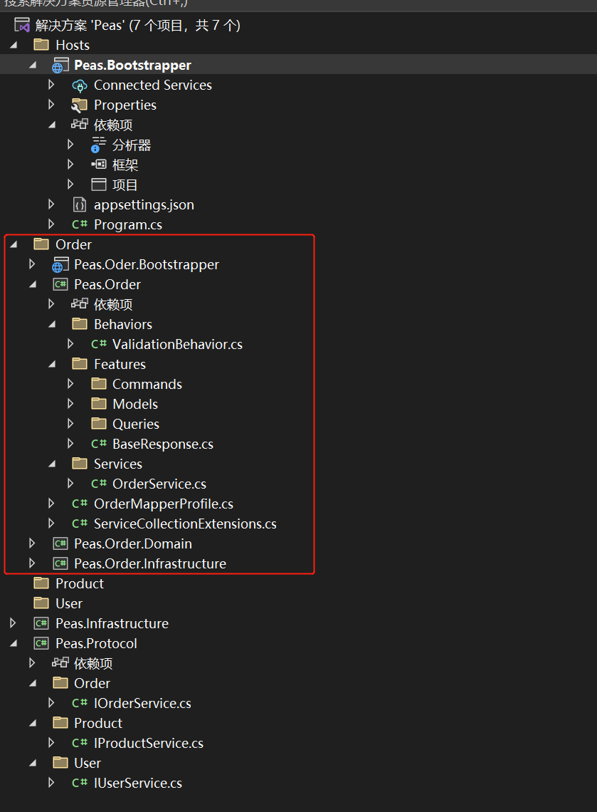
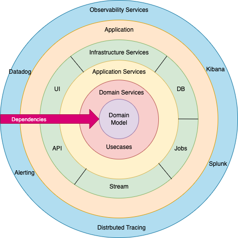
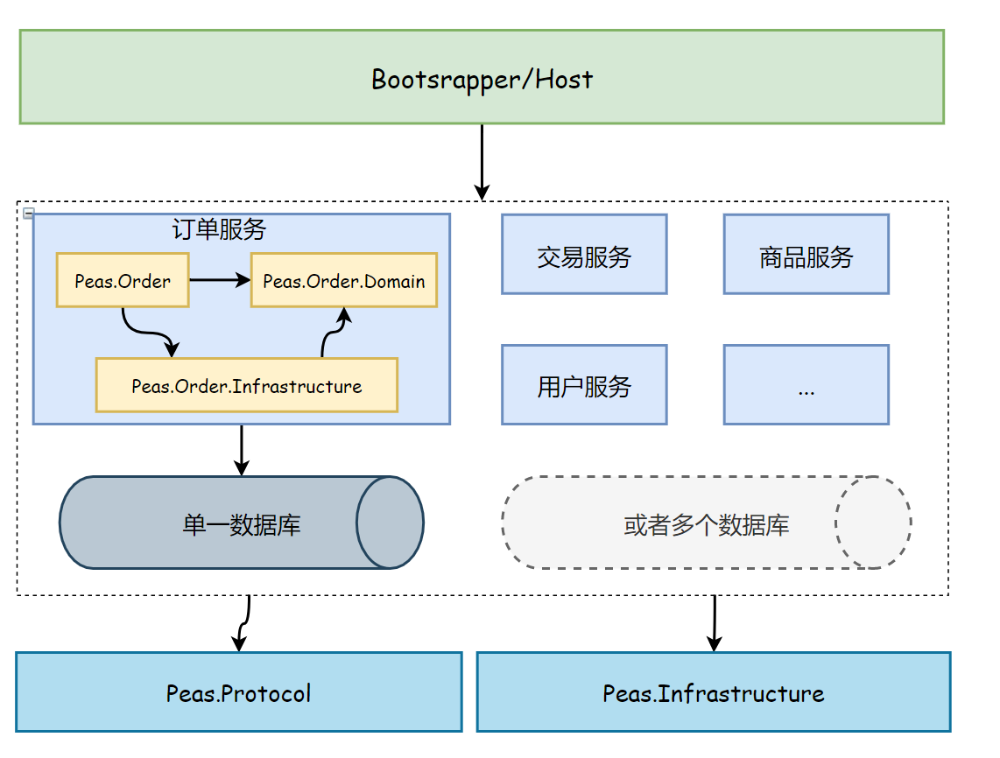
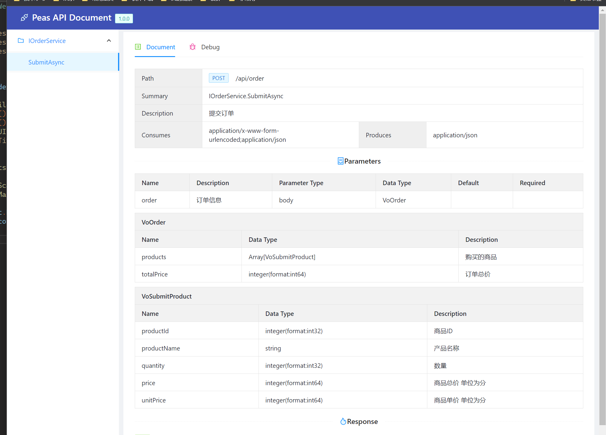

title: 模块化的服务架构设计
date: 2023-02-19 21:01:07
categories: 原创
tags: 
  - dotnet
  - rpc
  - dotbpe
  - architecture
---


**我们大多情况下并不需要微服务，也许80%的情况，也许更多。**

从微服务架构流行以来，越来越多的企业认识并开始采用这个架构来设计业务系统，有些甚至完全是不考虑业务规模和开发团队的规模。首先来说，微服务无疑是您实现大规模应用程序的最佳架构。但我们现在看到的趋势是，即使是中等规模的应用也倾向于使用它，它真的是必需的吗？大多数时候，答案是否定的。

虽然它是一个可扩展的体系结构，但它也有很多缺点。实际上，没有一个理想的解决方案是没有缺点的。这完全取决于需求和您对实施的满意程度。有的时候微服务所带来的复杂度甚至超过了项目本身

# 背景

本来想回顾下服务端架构设计的历史，但是写了又删，觉得都是老生常谈了，没有必要再展开来说。但是为了能说明为什么会有这样的设计，我觉得还是简略说下我的理解过程。

大约8-9年前吧，在前后端分离真正流行起来之前，React在国内还没怎么流行，Vue也没有出现。在那之前我开发了一套基于JQuery的UI插件（名字叫[xjplugin](https://github.com/xuanye/xjplugin)），在当时这种完全前后端分离的方式已经算是蛮先进了，于是当时并一直到后来使用React或者Vue，项目中服务端开发所做的事情就是开发接口，并且主要是以经典三层架构为主，以下是一个简单的图例。



我们有时候也叫做它N层架构，因为真实项目中业务层会根据复杂度再切分为业务外观层和业务逻辑层，还有一些通用代码的专用类库等，不过都是一样的，这就是一个传统的单体程序架构。

后来我接触的业务是给第三方（其实是公司的其他部门）提供接口，本身是没有界面的。所以当时开发的代码都是面向服务的，但又不是传统的SOA。公司历史的接口协议都是使用C++的Socket服务。而我维护的部分则是以Java重写的实现。后来OpenApi流行起来后，这些接口部分要对外需要提供Http接口，于是又在此基础上通过插件加上Http调用的实现。由于当时用Java写异步和多线程调用的代码非常别扭，萌生了使用C#重写一个服务化开发的框架，那时候.NetCore 刚刚1.0 ，C#5 之后引入的await async的关键大大方便了编写异步逻辑，因为只有在业余时间来完成我的构想，所以第一个版本续续写了大半年的时间。

再后来我领导一个手机端交友App的开发工作，一开始开发团队规模只有10个人不到（包括前后端和测试），但是老板的愿景是在一年之内发展为千万用户级别App[:(]。当时我内心是非常焦虑的，因为开发一个几万用户的应用和开发一个上千万用户的架构几乎是完全不同的。于是在那时一直就在思考一个问题，如何实现像单体应用一样方便开发，又可以像微服务一样快速扩展的架构。

# 一个面向微服务的单体架构

考虑到实践层面的困难，从一个单体应用过渡到微服务是一个真实的痛苦过程。显然按团队一开始的规模是无法承受这份痛苦的。而作为架构师则需要考虑，如果一开始采用单体架构，当你的产品用户群爆炸式增长时，你是如果快速过渡到服务的，**所以答案是一个面向未来，面向微服务的单体架构**。

这似乎是矛盾的。

下图是传统单体架构拆分为微服务架构的示意图：



之后有一种灵感，就是原来使用三层架构时，我有时也不真的建三个项目，而是使用文件夹来区分层级。那如果我们把上图右侧的部分看作一个解决方案中项目的结构，那又会是如何呢？




所有应用程序必须是高度模块化的，以改善开发体验。这需要将应用程序分解为多个逻辑模块，如商品、订单、用户等。
一个模块原本就切分比较合理的单体应用是很容易转换成模块化服务架构的。

这种架构的整体思路如下：

1. Api层特别瘦，只负责挂载服务，没有任何业务逻辑。
2. 中间部分是主要实现逻辑的部分，各个服务模块只负责自己业务的部分，各模块间严格禁止直接调用（同过API接口或者消息总线的方式来实现），如商品服务需要用户信息。
3. 数据库，你可以灵活的使用多个数据库-就是说每个模块一个，也可以共用一个数据库。
4. 共享的基础代码。

你可以看到这和标准的单体应用并没有太大差别。基本的方案就是将应用程序拆分为多个较小的模块，并使它们遵循独立体系结构原则。

但这里有一个问题就是服务间的调用是通过RPC的方式，这里性能上是不如直接进程内调用的。但是为了将来，解决我们的当前问题来看这并不是什么大问题。

在实际的项目中我开发了DotBPE.Rpc框架[[xuanye/dotbpe](https://github.com/xuanye/dotbpe)] ,解决了这个问题，框架中的服务调用是通过动态代理来实现的，可以判断服务是部署在进程内还是远端, 实现自动切换实现。


```csharp
public async Task<TService> CreateAsync<TService>(ushort spacialMessageId = 0) where TService : class
{
        var serviceType = typeof(TService);
        var cacheKey = $"{serviceType.FullName}${spacialMessageId}";`

      `if (_typeCache.TryGetValue(cacheKey, out var cacheService))
        {
            return (TService)cacheService;
        }

        var service = serviceType.GetCustomAttribute(typeof(RpcServiceAttribute), false);
        if (service == null)
        {
            throw new InvalidOperationException($"Miss RpcServiceAttribute at {serviceType}");
        }
        var sAttr = service as RpcServiceAttribute;

        var serviceIdentity = FormatServiceIdentity(sAttr.GroupName, sAttr.ServiceId, spacialMessageId);
        // $"{sAttr.ServiceId}${spacialMessageId};{sAttr.GroupName}";
        var servicePath = FormatServicePath(sAttr.ServiceId, spacialMessageId);

        var isLocal = await IsLocalCall(serviceIdentity);

//这里通过判断进入不同的分支，返回不同的实现
        TService proxy;
        if (isLocal)
        {
            var actor = _actorLocator.LocateServiceActor(servicePath);
            if (!(actor is TService realService))
            {
                throw new InvalidOperationException($"{serviceType.FullName} has no implementation class,should it be configured at remote server");
            }
            proxy = realService;
        }
        else
        {
            var interceptors = new List<IInterceptor>();
            interceptors.AddRange(_clientInterceptors);
            interceptors.Add(_remoteInvoker);
            proxy = _generator.CreateInterfaceProxyWithoutTarget<TService>(interceptors.ToArray());
        }
        _typeCache.TryAdd(cacheKey, proxy);
        return proxy;
    }
```

虽然DotBPE.Rpc在这几年经过了多个项目的验证，并且是开源的（使用MIT协议）。 但我并不推荐大家直接使用来开发自己的项目。 因为我本人要上班养家，没有足够的时间回答问题。但是可以一起交流学习。


这种架构的优点：
1. 明确区分关注点
2. 易于扩展
3. 与微服务相比复杂性更低
4. 低运营/部署成本。
5. 复用性
6. 有组织的依赖关系

但也有其不足，它与微服务架构对比，主要的缺点：

1. 不兼容多种技术/语言。
2. 对于大型团队需要考虑如何组织解决方案（可能需要多个）

总体上这个方案有点像前端的Monorepo项目


# 示例

就以上面的系统为例怎么建立解决方案，项目又如何组织呢？我喜欢给我写的小工具或者类库起一些植物或者水果的名字，这个项目我们就叫它豌豆（Peas）吧。



建立一个解决方案以Order Product  User作为模块，以Order为例

`Peas.Order` 项目是传统项目的Api层，如果是WebApi的话 ，Controller要建立在这里。

`Peas.Order.Domain`  这个项目是领域层也可以是三层架构中的业务逻辑层，包含所有的业务逻辑

`Peas.Order.Infrastructure` 这个项目是基层层，包括对外部资源的访问实现，如消息队列，ES，邮件等，同时包括Repository的实现（如果数据库访问使用Repository模式的话）

`Peas.Order.Bootstrapper` 这个项目并不是必须的，是用于测试单独部署Order服务，在开发阶段我们挂宅服务实际用的是 `Peas.Bootstrapper` 如果单体部署的化 也是用这个。

`Peas.Protocol` 是服务接口的定义，可以被所有项目访问。如果考虑到将来会有大型团队的情况，我建议使用Proto文件来定义服务，并使用gRPC来对外提供接口 （DotBPE.Rpc支持使用Proto文件定义并生成代码和直接用写代码定义接口两种方式）

每个模块都是一个单独的洋葱架构+CRQS，关于洋葱架构的细节请自行搜索（其实用经典三层也挺好）



整个项目的依赖关系如下



项目启动打开API文档页 就可以愉快的编码了



示例仓库地址: [https://github.com/xuanye/peas]

**注意这只是伪代码，只关注结构，逻辑并没有实现** 欢迎大家在本项目的issue中讨论相关的话题