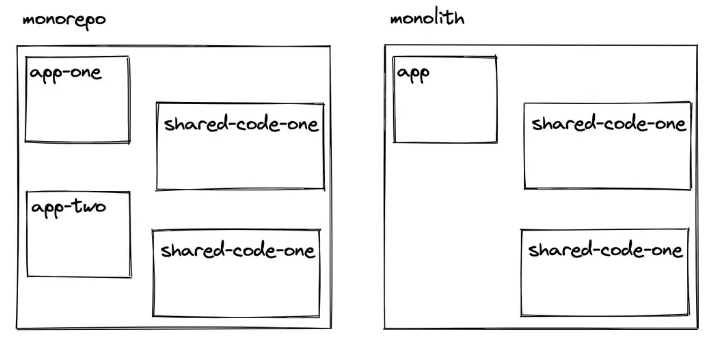
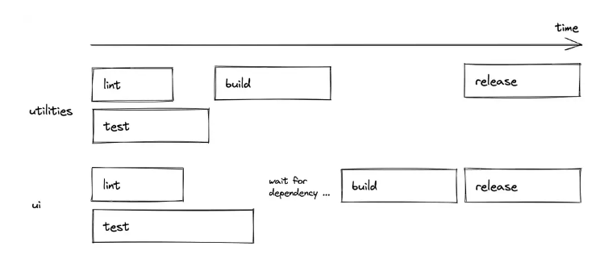
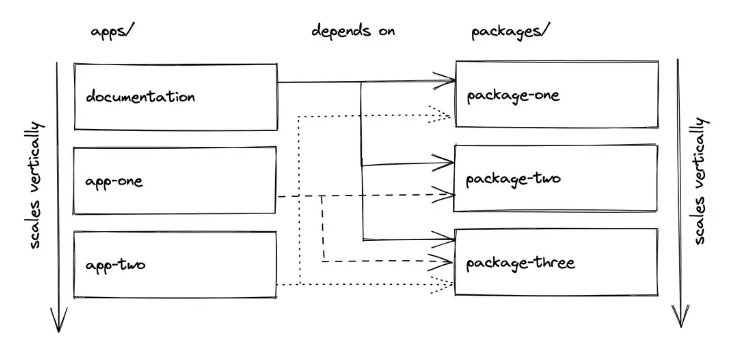
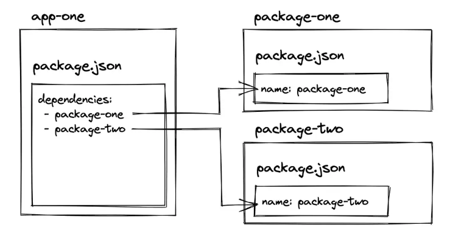
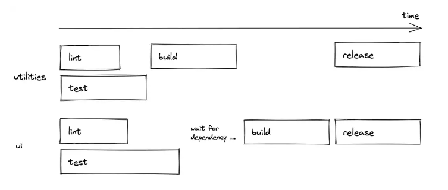
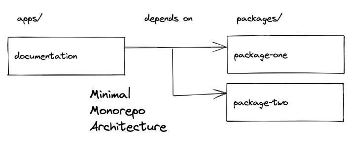
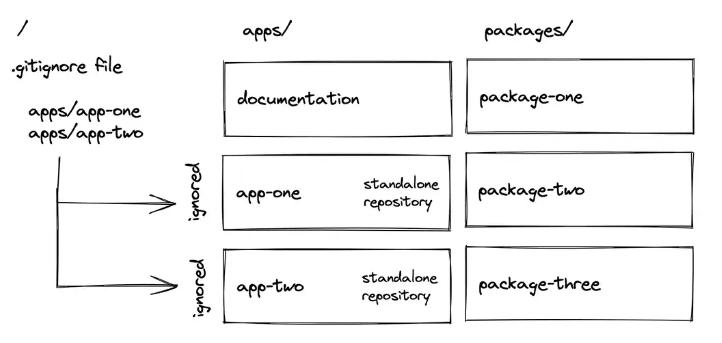
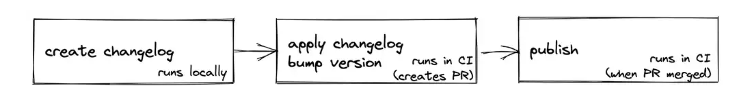

title: Monorepo在JavaScript/TypeScript中使用
date: 2022-07-15 10:01:07
categories: 翻译
tags: 

  - React
  - Monorepo
  - 最佳实践
---


> 该文章翻译自 https://www.robinwieruch.de/javascript-monorepos/

这是一个关于JavaScript/TypeScript中的Monorepos的综合教程------在前端应用程序中使用最先进的工具来实现这种架构。你将从本教程中了解到以下内容:

- 什么是Monorepo？
- 如何构建一个Monorepo架构？
- 如何创建一个Monorepo？
- Monorepo应该使用哪些工具？
- 如何在Monorepo中执行版本管理？
- 如何为Monorepo创建一个CI管道？
- 如何运行与Monorepo脱钩的应用程序？

我自己最近非常热衷于Monorepos，因为它们有助于我作为自由开发者的工作和我的开源项目。当我开始在JavaScript/TypeScript中使用monorepos时，我必须说，以这种方式组合应用程序和软件包感觉很自然。通过这个演练，我希望能把我在这个领域的经验传授给大家。

在教程中为了更好地说明问题，我们将选择使用React.js作为创建应用程序的框架，在这个monorepo中。然而，你也可以使用你自己喜欢的其他框架（例如Angular或Vue）。

## 什么是Monorepo
Monorepo是一个包含更小的项目的项目--而每个项目可以是任何东西，从单独的应用程序到可重用的包（如函数、组件）。合并项目的做法可以追溯到2000年初，当时它被称为共享代码库。

Monorepo这个名字源于mono（单一）和repo（仓库）这两个词。前者是不言自明的，后者来自于版本控制系统（如git），其中项目：仓库以n:n的关系（Polyrepo）或n:1的关系（Monorepo）托管。

通常，Monorepo被误认为是单体应用Monolith。然而，在一个单体应用（Monolith）中，所有的小项目都被合并成一个大项目。与此相反，Monorepo 可以将其较小的项目合并成多个项目。



Monorepos在谷歌等大公司使用的大规模代码库中很受欢迎。

>"谷歌代码库包括大约10亿个文件，有大约3500万次提交的历史，横跨谷歌整个18年的存在。" [2016]

>"谷歌的代码库是由来自世界各国几十个办公室的25000多名谷歌软件开发人员共享的。在一个典型的工作日里，他们向代码库提交了16,000项变更，另外24,000项变更由自动系统提交。" [2016]

然而，最近，Monorepos架构成为包含多个应用程序和共享包项目的流行架构.

## 为什么要使用
对于一个大规模的代码库来说，使用monorepo有两个主要的优势。首先，共享包可以在本地机器上的多个应用程序中使用，而不需要在线注册服务（如npm）。开发者的体验在这里得到了极大的改善，因为所有东西都在同一个代码库中，不需要通过第三方更新依赖关系。当一个共享包被更新时，它会立即反映在所有依赖它的应用程序中。

第二，它改善了跨代码库的协作。在不同项目上工作的团队可以改进其他团队的代码库，而不需要在多个存储库上工作。它还提高了可访问性，而不必担心不同的设置，并引入了一个更灵活的跨团队的源代码所有权。另一个好处是跨许多项目的代码重构。

## Monorepo项目的目录结构
一个monorepo可以包含多个应用程），而每个应用程序都可以访问共享的软件包集。这是常见的一种monorepo项目结构

```
- apps/
--- app-one
--- app-two
- packages/
--- package-one
--- package-two
--- package-three
```

一个package，只是一个文件夹，可以是任何东西，从UI组件（如component）到功能（如utilities）再到配置（如ESLint、TypeScript）。

一个package可以依赖另一个package。例如，ui可能使用utilities的功能，因此ui依赖于utilities。ui和utilities包，都可能使用其他*-config包的配置。

应用程序通常不会相互依赖，相反，它们只是引用package。如果package之间相互依赖，monorepo管道（见Monorepo工具）可以强制执行 "只有在utilities构建成功后才开始ui构建 "这样的情况。




因为我们在这里说的是 JavaScript/TypeScript 项目，一个应用程序可以是一个 JavaScript 或 TypeScript 应用程序，而只有 TypeScript 应用程序会使用共享的 ts-config 包（或创建他们自己的配置或使用两者的混合）。

App中不一定要全部引入所有的package，他们可以选择使用需要的UI组件、函数和配置。如果app决定使用某个package，就必须在其目录的package.json文件中定义它。

```json
{
  "dependencies": {
    "ui": "*",
    "utilities": "*",
    "eslint-config": "*"
  },
}
```

app可以是任意的形式，从SSR应用（例如Next.js）到CSR应用（例如CRA/Vite）

换句话说：app不知道是自己是 monorepo 中的 repo，它们只是定义依赖关系。 monorepo（请参阅 Monorepos 中的工作区）然后决定依赖项是来自 monorepo还是来自注册服务（npm service）。

相反，这意味着app可以在不属于monorepo的情况下使用。唯一的要求是它的所有依赖项（这里：ui、实用程序、eslint-config）都发布在像 npm 这样的注册表上，因为当用作独立应用程序时，不再有具有共享依赖项的 monorepo。

## 如何创建一个Monorepo项目

在所有这些关于monorepos的理论学习之后，我们将通过一个monorepo的例子来验证这些内容。因此，我们将用React创建一个示例程序，它使用一组共享的组件/配置（包）。并不是一定要使用React，你可以把它改编成你自己选择的框架（例如Angular或Vue）。

不过我们不会从头开始创建一个monorepo，因为这将涉及到太多的步骤，会使整个主题难以理解。相反，我们将使用一个初始单体项目。在使用它的时候，我将一步一步地指导你完成所有的实施细节。

首先，将monorepo startter克隆到你的本地机器上。

```
git clone git@github.com:bigstair-monorepo/monorepo.git
```
我们在这里使用yarn作为npm的替代品，不仅是为了安装依赖，也是为了以后使用所谓的工作空间。在下一节（见Monorepos中的工作空间），你将了解工作空间和与yarn工作空间相对应的其他工作空间工具。现在，进入monorepo目录，用yarn安装所有的依赖项。

```
cd monorepo
yarn install
```

我们稍后再讨论这个部分，先来看下monorepo的结构：
```
- apps/
--- docs
- packages/
--- bigstair-core
--- bigstair-map
--- eslint-config-bigstair
--- ts-config-bigstair
```

monorepo带有一个 "内置 "的应用程序，叫做docs in apps，用于存放文档。以后我们会在文档旁边集成实际的应用程序（见Monorepos中的工作空间）。

此外，还有四个包--两个包是共享的UI组件（这里：bigstair-core和bigstair-map），两个包是共享配置（这里：eslint-config-bigstair和ts-config-bigstair）。

我们在这里处理的是一个叫做bigstair的假公司，这在后面会变得很重要（见Monorepos的版本管理）。现在，只要想一想bigstair的命名，这可能会使它更容易接近。此外，我们不会把重点放在ESLint和TypeScript的配置上。你可以在后面看看它们是如何在包和应用程序中被重用的，但对我们来说重要的是实际的应用程序和实际的共享包。
```
- apps/
--- docs
- packages/
--- core
--- map
```
对于这两个package来说，你想象一下在是我们的app中需要使用的任何JavaScript/TypeScript相关的代码。例如，core package有基本的UI组件，如按钮、下拉菜单和对话框，而地图包可以有一个可重复使用但更复杂的地图组件。从app目录的角度来看，这些独立的包就像解决不同问题的库。毕竟，这只表明包文件夹可以像应用程序文件夹一样垂直扩展

要结束本节，请运行以下命令来运行 apps/docs 应用程序。我们稍后会讨论（参见 Monorepo 工具）为什么这个命令首先允许我们在应用程序文件夹中启动嵌套应用程序：

```
yarn dev
```
您应该会看到一本[StoryPoint][1]，其中显示了核心和地图包中的组件。在这种情况下，为了简单起见，这些组件只是按钮（而不是地图）。如果你查看 core 和 map 包的源代码，你应该会发现这些组件的实现：

```
import * as React from 'react';

export interface ButtonProps {
  children: React.ReactNode;
}

export function Button(props: ButtonProps) {
  return <button>{props.children}</button>;
}

Button.displayName = 'Button';
```

此外，两个包的 package.json 文件都定义了一个 name 属性，该属性在 docs 应用程序的 package.json 中定义为依赖项:

```
"dependencies": {
  "@bigstair/core": "*",
  "@bigstair/map": "*",
  "react": "18.0.0",
  "react-dom": "18.0.0"
},
```
如果这两个package都可以通过 npm registery获得，则 docs 应用程序可以从那里安装它。但是，如前所述，由于我们正在使用工作空间设置 monorepo（请参阅 Monorepos 中的工作空间），因此 docs 应用程序的 package.json 文件首先检查这些包是否存在于 monorepo 中，然后再使用npm registery作为后备。

最后，检查 docs 应用程序的实现代码。在那里你会看到它像第三方库一样导入包，即使它们是 monorepo 中的包：

```
import { Button } from '@bigstair/core';
```
这再次证明了一个事实，即应用程序不知道它在monorepo中扮演了一个角色。如果它不在monorepo中，它就会直接从npm注册表中安装依赖项。

在我们的例子中，monorepo由多个apps/packages共同工作组成。在后台，一个叫做workspaces的工具使我们能够创建一个文件夹结构，应用程序可以使用包作为依赖。在我们的案例中，我们使用[yarn workspaces][2]来完成我们的目标。也有一些替代品，如[npm workspaces][3]和[pnpm workspaces][4]。

一个yarn工作区在顶层package.json文件中以如下方式定义
```
"workspaces": [
  "packages/*",
  "apps/*"
],
```

由于我们已经预计到我们有多个应用程序和包，我们可以直接指向文件夹路径，并使用通配符作为子路径。这样一来，apps/packages中的每一个文件夹，只要有package.json文件，都会被选中。现在，如果应用程序想从包中包含一个包，它只需在自己的package.json文件中使用包的package.json文件的名称属性作为依赖（正如我们之前看到的）。

在实践中，它是关于多个应用程序可以选择本地软件包作为依赖关系。然而，到目前为止，我们只使用了docs应用程序，它使用我们monorepo的软件包。此外，docs 应用程序只是用来记录这些软件包的。我们想要的是使用这些共享包的实际应用。



切换到apps文件夹，在那里我们将克隆两个新的app到monorepo中。之后，再次切换回来，安装所有新的依赖项

```
cd apps
git clone git@github.com:bigstair-monorepo/app-vite-js.git
git clone git@github.com:bigstair-monorepo/app-vite-ts.git
cd ..
yarn install
```

这里需要安装所有的依赖项是为了两件事

- 首先，apps中的新app需要安装它们的所有依赖项--包括它们定义为依赖项的软件包。

- 第二，随着两个新的嵌套工作区的加入，应用程序和软件包之间可能会有新的依赖关系，需要解决这些问题，以便让所有工作区一起工作。

现在，当你用`yarn dev`启动所有应用程序时，你应该看到故事书出现了，此外还有两个新的React应用程序，它们使用软件包中的Button组件。

两个克隆的app都是用Vite引导的React应用程序初始模板 ，唯一变化是它在package.json中的依赖关系，它将我们工作区的包添加为第三方依赖。

```
"dependencies": {
  "@bigstair/core": "*",
  "@bigstair/map": "*",
  ...
}
```
之后，他们只是像我们之前在文档中一样使用共享组件：
```
import { Button } from '@bigstair/core';
```

因为我们是在一个monorepo设置中工作的，更具体地说，是在工作区设置中工作的。它定义了项目（这里：应用程序和包）之间的这种联系，安装时这些依赖关系会先在本地工作区查找，如果查不到才会去访问npm这样的注册服务。



正如你所看到的，任何JavaScript或TypeScript应用程序都可以通过这种方式在apps文件夹中启动。继续创建你自己的应用程序，将软件包定义为依赖项，用yarn install 安装所有依赖，并使用软件包工作区的共享组件。

在这一点上，你已经看到了顶层目录中的全局package.json文件，以及apps和package中每个项目的本地package.json文件。顶层的package.json文件除了定义工作区外，还定义了全局的依赖关系（如eslint，prettier），这些依赖关系可以在每个嵌套的工作区中使用。相比之下，嵌套的package.json文件只定义实际项目中需要的依赖关系。

## Monorepo 工具

你已经见证了工作空间是如何让我们创建一个monorepo结构的。然而，虽然工作空间使开发者能够将单项目中的项目相互连接起来，但专门的单项目工具却带来了改进的开发者体验。在输入以下命令时，你已经看到了其中一个实在的改进。

```
yarn dev
```

从顶级文件夹执行此命令会启动 monorepo 中的所有项目，这些项目的 package.json 文件中有一个 dev 脚本。其他几个命令也是如此：

```
yarn lint
yarn build
yarn clean
```

如果你检查顶层的package.json文件，你会看到一堆总体性的脚本。

```
"scripts": {
  "dev": "turbo run dev",
  "lint": "turbo run lint",
  "build": "turbo run build",
  "clean": "turbo run clean",
  ...
},
"devDependencies": {
  ...
  "turbo": "latest"
}
```
一个叫做[Turborepo][5]的monorepo开发工具允许我们定义这些脚本。其他的monorepo工具有[Lerna][6]和[Nx][7]。Turborepo有几种配置，可以让你并行（默认）、按顺序或过滤地执行其嵌套工作区的脚本。
```
"scripts": {
  "dev": "turbo run dev --filter=\"docs\"",
  ...
},
```

此外，你可以创建一个 turbo.json 文件，为所有的脚本定义一个 monorepo 管道。例如，如果一个包在包工作区有另一个包作为依赖，那么可以在构建脚本的管道中定义，前一个包必须等待后一个包的构建




最后但同样重要的是，Turborepo具有先进的文件缓存功能，可以在本地（默认）和远程工作。你可以在任何时候选择退出本地缓存。你可以查看Turborepo的文档，就不再本文中详细介绍了.

## Monorepo中的文档

因为许多monorepo都带有访问一组共享包的应用 ，专门用于生成文档和记录一些内容，同时也能访问这些包，这已经是一个完美的架构了。



我们初始的monorepo已经带有一个docs应用程序，它使用Storybook来介绍所有包的UI组件的使用。然而，如果共享包不是UI组件，你可能希望有其他工具来做这些事情。

从这个 "最小的monorepo架构 "中，它带有共享package和这些package的文档，通过文档应用中引用这些package 来证明monorepo架构的正确工作，我们可以通过添加更多的app或package来扩展这个结构，正如我们在Monorepos的工作空间部分所做的那样。

## git中使用 Monorepo VS Polyrepo

如果没有什么反对意见的话，我们可以在一个Git仓库中托管一个单库，其中包含所有的工作空间。这毕竟是monorepo项目的主要定义。然而，一旦一个monorepo规模扩大到多个工作空间，也许有必要（见例子：Monorepos作为孵化器）将monorepo分离成多个 Git 仓库。这就是我们在monorepo演练中已经做的应用（除了docs）。

可能有很多方法可以将一个单版本的Git仓库转移到多个Git仓库中--本质上是创建一个伪装成monorepo版本的多版本仓库。在我们的例子中，我们只是使用了一个顶层的.gitignore文件，它忽略了应用程序中的两个嵌套工作空间，这些工作空间应该有自己的专用Git仓库。



然而，这样我们总是在所有工作空间（这里是指应用程序和包）的最新版本上工作，因为当把所有嵌套的工作空间克隆到monorepo或作为独立的应用程序时，它们只是使用最近的代码。接下来我们在考虑版本问题时，会绕过这个问题。

## Monorepo的版本控制

应用版本，尤其是对Monorepo程序中的共享包，最终可能会在包管理器（如npm注册服务）中上线，并不像预期的那样简单。有多种挑战，比如包可以相互依赖，有不止一个包需要注意，包是包中的嵌套文件夹，每个包都要有自己的更新日志和发布过程

在monorepo初始化设置，包的行为比如依赖关系，因为应用程序是在工作区设置中使用它们（而不是在注册服务端）。但如果一个应用程序不想在工作区使用某个包的最新版本，它可以定义一个更具体的版本。

在这种情况下，如果工作区的包的版本与指定的版本不同，安装脚本就不会使用工作区的包，而会使用注册表。因此，我们需要一种方法，在开发monorepo时为软件包创建版本、更新日志和发布

```
"dependencies": {
  "@bigstair/core": "1.0.0",
  "@bigstair/map": "1.0.0",
  ...
}
```

在这种情况下，如果工作区的包的版本与指定的版本不同，安装脚本就不会使用工作区的包，而会使用注册表。因此，我们需要一种方法，在开发monorepo时为软件包创建版本、更新日志和发布

[changesets][8]项目是一个流行的工具，用于管理多包仓库（如monorepo）中多个包的版本。我们的monorepo设置已经配备了改变集的安装和定义在顶层package.json文件中的脚本。我们将逐步介绍这些changesets脚本。

```
"scripts": {
  ...
  "changeset-create": "changeset",
  "changeset-apply": "changeset version",
  "release": "turbo run build && changeset publish"
},
```
包的版本管理将它们发布到一个注册表（如npm）。如果你想跟着做，你需要执行以下步骤:

- 在 npm 上创建一个允许您发布包的组织
- npm login on the command line在命令行上 npm 登录
- 修改代码中所有的组织名称- bigstair
- 使用 `yarn install && yarn dev` 验证是否如预期一样  

  

发布一个包的新版本的另外一个先决条件是：首先我们要进入package自己的版本号。然后修改所有引用它的UI组件修改关联的版本号，最后是将所有更改提交到npm。


- 首先，运行 `yarn changeset-create`，它使您能够为更改的包创建更改日志。提示将引导您选择一个包（使用空格键）、选择 发布类型（主要、次要、补丁），并编写实际的更改日志。如果您之后使用 git status 检查您的存储库，您将看到更改后的源代码以及新创建的更改日志文件。如果包相互依赖，则链接的包稍后也会出现版本提升。

- 其次，如果变更日志文件正常，运行 `yarn changeset-apply` 将变更日志和版本应用到实际包中。如果一切看起来都符合要求，你可以使用 `git status` 和 `git diff` 再次检查。

- 第三，如果一切正常，继续使用 `yarn release` 将更新的包发布到 npm。发布后，在 npm 上验证你的新版本是否已在那里发布。

本质上，这就是在本地机器上对包进行版本控制的一切。下一节通过对版本控制 (2) 和发布 (3) 步骤使用持续集成更进一步。


## 与Monorepo的持续集成

monorepo 的持续集成 (CI) 的复杂性取决于在 GitHub 等版本控制平台上管理的存储库数量。在我们的例子中，所有包都在同一个存储库中（这里它们是 monorepo 本身的一部分）。因此，我们只需要关心这个存储库的 CI，因为在本节中，所有内容都与软件包的发布有关。

示例 monorepo 已经将 GitHub Actions 用于 CI。打开 .github/workflows.release.yml 文件，该文件为 GitHub 操作提供以下内容：

```yaml
name: Release

on:
  push:
    branches:
      - main

concurrency: ${{ github.workflow }}-${{ github.ref }}

jobs:
  release:
    name: Release
    runs-on: ubuntu-latest
    steps:
      - name: Checkout Repository
        uses: actions/checkout@v2
        with:
          fetch-depth: 0

      - name: Setup Node.js 16.x
        uses: actions/setup-node@v2
        with:
          node-version: 16.x

      - name: Install Dependencies
        run: yarn install

      - name: Create Release Pull Request or Publish to npm
        id: changesets
        uses: changesets/action@v1
        with:
          publish: yarn release
        env:
          GITHUB_TOKEN: ${{ secrets.GITHUB_TOKEN }}
          NPM_TOKEN: ${{ secrets.NPM_TOKEN }}
```

*注意：如果此工作流应该在您自己的 GitHub 存储库上运行，您必须在 npm 上创建一个 NPM_TOKEN 并将其用作 GitHub 上的存储库密码。此外，您还需要为您的组织/存储库启用“允许 GitHub 操作创建和批准拉取请求”。*



现在，再次更改其中一个包中的组件。之后使用 `yarn changeset-create` 在本地创建变更日志。接下来，将所有更改（源代码更改 + 更改日志）推送到 GitHub。从那里，带有 GitHub 操作的 CI 将接管你的 monorepo 包。如果 CI 成功，它会使用增加的版本和变更日志创建一个新的 PR。一旦这个 PR 被合并，CI 会再次运行并将包发布到 npm。

## Monorepo 架构

如今，Monorepos 变得越来越流行，因为它们允许您将源代码拆分为多个应用程序/包（自认为的 monorepo 结构），同时仍然能够在一个地方管理所有内容。首先拥有 monorepo 的第一个推动因素是 Workspaces。在我们的例子中，我们一直在使用 yarn 工作空间，但是 npm 和 pnpm 也带有工作空间。

第二个促成因素是 monorepo 工具，它允许以更方便的方式在全局范围运行脚本，在 monorepo 中编排脚本（例如 Turborepo 中的管道），或在本地/远程缓存已执行的脚本。 Turborepo 是该领域的热门竞争者之一。 Lerna 和 Nx 是它的两个替代方案

如果在 Git 中使用 monorepo，则可以选择将单个存储库拆分为多个存储库（伪装成 monorepo 的 polyrepo）。在我们的场景中，我们一直在使用一个简单的 .gitignore 文件。然而，这个问题可能还有其他解决方案。

在版本控制的情况下，**Changesets**是一种流行的工具，用于为 monorepo 创建变更日志、版本和发布。它是 monorepo 空间中语义化发布([semantic release](https://github.com/semantic-release/semantic-release) )的方案。

总之，Workspaces、Turborepo 和 Changesets 是 monorepo 工具的完美组合，可用于在 JavaScript/TypeScript 中创建、管理和扩展 monorepo。

## 示例：作为孵化器的 MONOREPOS

在我最近作为一名自由前端开发人员的工作中，我不得不为一家公司建立一个 monorepo。该公司是一家为其他公司开发应用程序的软件公司。多年来，他们在内部开发了包（例如 UI 组件）。

monorepo 的目标：能够同时为客户端开发应用程序，同时能够使用具有出色开发体验的共享包。

它提到了开发体验，因为这是使用 monorepo 的重点（请参阅为什么使用 Monorepo）：对比从 npm 安装软件包，我们可以在 monorepo 的项目内修改它们并查看应用程序中反映的更改。否则在调整 UI 库时，我们将不得不经历整个发布 + 安装周期。

一个项目的产生分为**Incubating**和**Hatching**两个连续的部分，我将在下面进行探讨。

**Incubating**：当项目加入 monorepo 时，我们/他们通过 git 创建一个存储库，我们将其克隆到我们的 monorepo 中。从那里，我们可以从 monorepo 中选择共享包作为依赖项。由于共享包的强制版本控制，客户端可以随时将存储库克隆为独立项目（无需依赖 monorepo），同时能够从注册表安装所有依赖项。

**Hatching**：一旦客户下线，我们会为其项目的 package.json 中的所有依赖项设置最终版本。从那里，升级软件包是他们的责任。因此，如果客户决定升级其中一个，我们会自动生成内部包的变更日志。


## Monorepo的常见问题

**前端和后端都有有 Monorepos 吗？**当我们需要前后端一起工作时，它们通常通过 API 松散耦合。但是，前端和后端仍然可以在各个方面使用共享包（类型安全的 API 接口、实用程序函数、服务器端组件）。因此，完全有可能同时拥有一个 CSR React 应用、一个 SSR React 应用（例如 Next.js）和一个 Express 应用。

**Monorepos 和 Monoliths 一样吗？**他们不一样。 monorepo 可以生成一个单体应用程序，但是更有可能并排的应用程序共享公司的域或一组包，但不是一个独立的应用程序（Monolith的定义）。最后，只需要跨多个项目共享代码。

**微前端有 Monorepos 吗？**在这里我不能引用任何东西，但是，绝对有可能在一个 monorepo 中并排创建一个面向用户的应用程序和一个面向管理员的应用程序，开发人员决定是否将两者拼接在一起作为一个整体，或者它们是否是不同的独立应用程序（子）域（例如 my-application.com 和 admin.my-application.com）。


[1]: https://storybook.js.org/
[2]: https://yarnpkg.com/features/workspaces
[3]: https://docs.npmjs.com/cli/v7/using-npm/workspaces
[4]: https://pnpm.io/workspaces
[5]: https://turborepo.org/
[6]: https://lerna.js.org/
[7]: https://nx.dev/
[8]: https://github.com/changesets/changesets